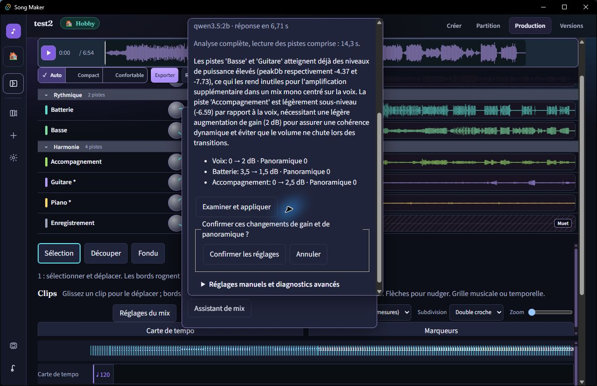

# Audit Windows — 1 octobre 2026

Observations dans la fenêtre Tauri de développement, sur un projet existant de sept pistes, durée 6:54, avec une RTX 4080 SUPER et Qwen 3.5 2B installé dans Ollama. Les observations ci-dessous ne proviennent pas du navigateur de démonstration. La capture native, bordure comprise, mesure 1282 × 832 ; aucune capture native à 640 px n'est revendiquée.

## Bugs reproduits et corrections

- #264 : panneau de l'assistant écrasé en bas de fenêtre. Correction `preferAboveAnchor`, fusionnée dans #265. Le titre et le bouton d'analyse sont visibles à l'ouverture. Le test de géométrie reproduit la hauteur du déclencheur natif ; retirer le correctif fait échouer ce test.
- #266 : les analyses natives rejettent une réponse Qwen dépassant 6 dB de changement sur au moins une piste. Le diagnostic distingue maintenant `GAIN_DELTA`, identifiant inconnu, doublon, bornes et JSON invalide. Il n'affiche ni réponse brute ni données de piste dans le détail d'erreur.
- Le contrat du modèle décrit les bornes absolues propres à chaque piste et associe chaque identifiant à ses valeurs de gain admissibles, par pas de 0,5 dB. Une tentative avec les seules bornes numériques du schéma échouait encore dans Tauri. La liste de valeurs admissibles produit ensuite deux propositions natives valides. Les validations Rust et TypeScript restent actives ; les réglages manuels conservent leur précision.

## Confirmation, persistance et annulation mesurées

La proposition native règle Voix 0 → 2 dB, Batterie 3,5 → 1,5 dB et Accompagnement 0 → 2,5 dB, sans changer les autres pistes ni leur panoramique.

1. Après proposition puis « Examiner et appliquer », le fichier du mix est inchangé.
2. Après « Confirmer les réglages », les trois gains sont présents dans l'interface et le JSON sauvegardé.
3. « Annuler les réglages de Qwen » restaure les gains et panoramiques de toutes les pistes en une action. Le fichier retrouve exactement son SHA-256 initial : `a240af3e659d96847175f0418a83cea5425a7b57ea22325fc6c6554571b86b39`.

SHA-256 de la capture JPEG native : `9c8fe16d594fc35dabb29b755893b1ca1d23874cfbc7e4b1ed7bf13f71cd307a`.

## Performances observées

| Parcours natif | Réponse du modèle | Analyse complète, lecture et décodage compris |
|---|---:|---:|
| Première proposition valide, service déjà actif | 1,69 s | Non instrumentée à cet instant |
| Proposition après relance du service local | 6,71 s | 14,3 s |

La mesure complète commence avant le décodage et finit après réception et validation de la proposition. Le temps de réponse backend reste affiché séparément. Les valeurs affichées sont arrondies au centième de seconde. L'état « Ouvrez Ollama sur cet ordinateur puis relancez » a également été observé lorsque le service était arrêté, puis le parcours a réussi après sa relance. Aucun téléchargement de modèle n'a été effectué pendant cet audit.

Ces deux observations fournissent une référence sur cette machine, pas un seuil général ni une preuve d'amélioration musicale. Le diagnostic indépendant sur les WAV ne remplace pas cette mesure Tauri. Le script de diagnostic local demeure non suivi et les fichiers personnels ont été conservés.

## Validation et limites

Les tests ciblés couvrent le contrat par piste, le rejet d'identifiants et de gains invalides, la confirmation/annulation, la géométrie native reproduite, la parité FR/EN et le diagnostic fermé qui ne révèle que le code autorisé. TypeScript, compilation de production et Clippy passent.

Le recalcul à l'ouverture du projet retarde la navigation ; le temps exact n'a pas été instrumenté dans ce lot. L'écoute comparative, les lecteurs d'écran, le tactile, les captures natives à 640 px et la campagne complète sur les autres fonctions restent à faire. #235 conserve ces réserves ; #223–#230 conservent leurs critères restant à livrer, la section suivante apporte ensuite la fusion de l'axe graphique des pistes et des clips. Les dépendances de #209, #170 et #164 ne sont pas déclarées résolues par cet audit.

## Une liste de pistes et une règle lisible

La vérification native du 1er octobre s'est poursuivie sur un mix réel de 6 min 54 s, à zoom 1. Une seule ligne porte désormais le clip et les commandes gain/pan/Muet/Solo/outils. Les sept pistes du projet sont accessibles dans leurs groupes. Le popover de la piste Voix a été ouvert, sa bascule d'automation atteinte par défilement, la courbe dépliée, le popover fermé avec Échap, puis la courbe repliée. Aucun point n'a été ajouté ni aucune valeur modifiée pendant cette séquence. Le SHA-256 du mix JSON est resté `a240af3e659d96847175f0418a83cea5425a7b57ea22325fc6c6554571b86b39`.

Le chevauchement des numéros de mesures sur les morceaux longs a été observé dans la fenêtre maximisée et consigné dans #271. Après correction, les libellés sont espacés dans la fenêtre restaurée à environ 1280×830. La capture enregistrée du défaut initial était un fragment annexe et a été écartée. Seule la capture native après correction est conservée ; aucune comparaison pixel à pixel avant/après n'est revendiquée.

- `shared-axis-native-after.jpg` : règle lisible, clip réel et courbe vide sous sa piste sur le même axe.

L'alignement à 1 px et le maintien vertical des trois lignes pendant le défilement sont mesurés par les tests React à 1280×720 et 640×720, distincts de l'inspection native. Les tests vérifient aussi le changement de gain au clavier sans déplacer le clip sélectionné. La séquence native ne prouve pas l'édition de points ni la qualité audio. L'écoute comparative et les autres systèmes d'exploitation restent non testés.
