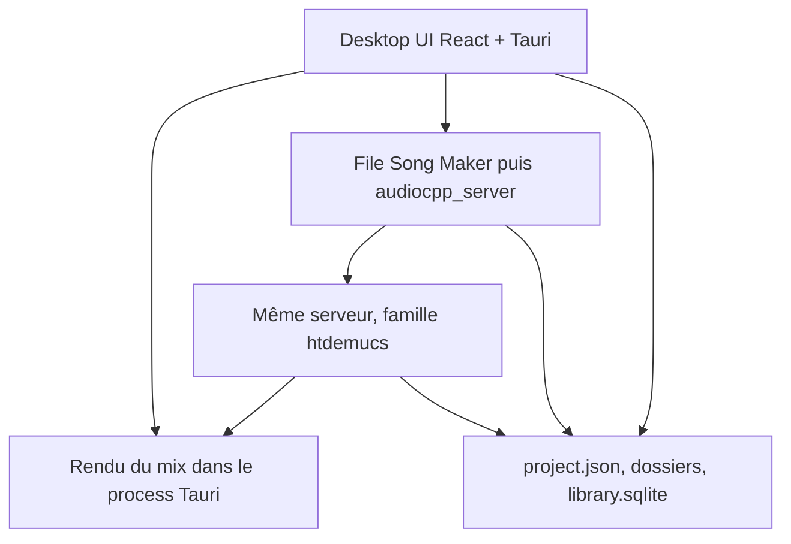
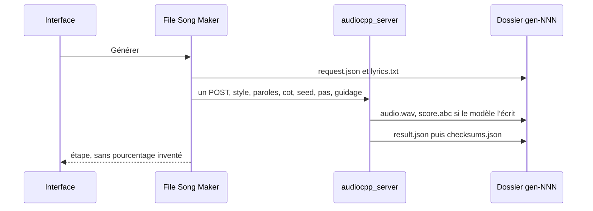
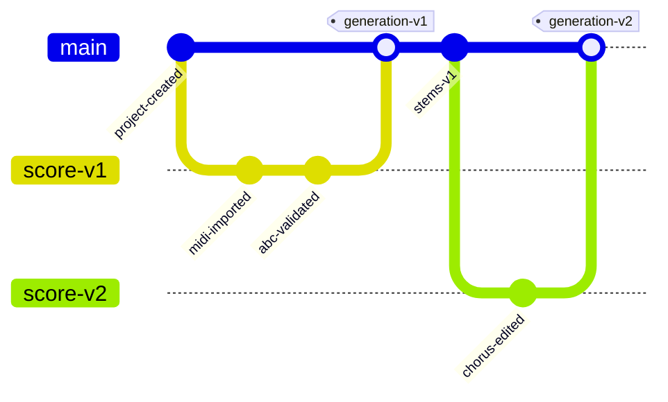

# Song Maker — Spécification produit et technique

**Version :** 1.0  
**Statut :** contrat du premier build  
**Remplace :** la proposition 0.2 sur le périmètre de ce build. Les phases 2, 3 et 4 restent décrites ; elles ne sont pas des critères d’acceptation.  
**Cible :** application desktop locale  
**Famille de modèles :** YuE2-3B (upstream `m-a-p/YuE2-3B`)  
**Moteur du premier build :** [audio.cpp](https://github.com/0xShug0/audio.cpp) `v0.8.1` + GGUF [`audio-cpp/Yue2-3B-GGUF`](https://huggingface.co/audio-cpp/Yue2-3B-GGUF)  
**Hors de ce build :** runtime Python YuE2, SheetSage2, service distant  
**Principe du premier build :** saisir un style et des paroles, générer un WAV, séparer, mixer  
**Direction ultérieure :** composer en symboles, puis régénérer et éditer

Les images de `specs/maquettes/` sont des références visuelles. Elles ne décrivent pas le produit.

## 1. Résumé exécutif

Song Maker est une application desktop locale. Le premier build crée un morceau à partir d’un style, de paroles non vides et d’un mode `cot`, lance un appel audio.cpp YuE2, écoute le stéréo, sépare quatre stems, puis mixe et exporte. Un projet est un morceau.

Le chemin qui marche sans partition utilisateur est `style` + paroles + `cot=full`. Le moteur n’a pas de durée, refuse les paroles vides, et ne time-stretch pas un WAV. Le premier build ne demande donc pas d’éditeur de partition. Ce trajet est la phase 1. L’éditeur de partition, l’import MIDI et le mapping MIDI vers ABC sont la phase 2. Le mapping reste le risque élevé du §25 ; son contrat est écrit au §7 pour ne pas l’inventer dans le code plus tard.

Le provider du premier build est audio.cpp, binaire épinglé, poids GGUF, sans Python. Le runtime Python officiel n’est pas installé, pas proposé au premier lancement, et pas un repli en cas de mémoire insuffisante.

Le morceau stéréo est ensuite séparé par HTDemucs, dans le même serveur, après le rééchantillonnage du §9. Les stems — voix, batterie, basse, accompagnement — entrent dans le mix comme une piste chacune.

## 2. Capacités YuE2 et moteur d’inférence

### 2.1 Capacités du moteur épinglé

Contraintes d’intégration, lues sur audio.cpp `v0.8.1` et sur la famille YuE2 :

- YuE2 génère un morceau complet à partir d’un `style` non vide et de paroles non vides, avec voix et accompagnement. Une chaîne de paroles vide est refusée.
- Il n’y a pas d’argument de durée, de genre, de mood, de langue, de tempo ni de tonalité. Ces mots, quand ils existent dans le produit, sont du texte assemblé dans `style`, ou des champs de partition pour la phase 2. Ils ne sont pas un contrôle du WAV déjà rendu.
- YuE2 peut écrire un artefact `score.abc` lorsque le modèle produit son propre plan (`cot=melody` ou `cot=full` sans ABC externe). Le premier build le conserve et l’affiche. Il ne l’édite pas.
- Une partition ABC personnalisée peut être fournie en `cot=full` ou `cot=melody`. Ce n’est pas le chemin du premier build : `abcPath` reste `null`. Un ABC envoyé avec `cot=off` est une erreur, locale puis moteur.
- Le mode `cot=off` produit l’audio sans partition en retour. Il reste dans le formulaire, marqué avancé. Le défaut est `full`.
- La sortie est un WAV stéréo 48 kHz (`yue2-vae-config.json`, `"sample_rate": 48000`).
- Les stems ne sont pas un artefact natif de YuE2. La séparation est HTDemucs, étape suivante.
- YuE2 ne consomme pas d’audio en entrée. Pas d’inpainting local, pas d’alignement phonémique, pas de référence audio directe. Une génération est un nouvel appel, un nouveau dossier.
- Un appel produit un candidat. Plusieurs candidats sont plusieurs appels.

Sources : [docs/models/yue2.md](https://github.com/0xShug0/audio.cpp/blob/v0.8.1/docs/models/yue2.md) au tag `v0.8.1` (commit `f2b4937306daa25f5c78520f3c626ed31495a37a`), [guide de génération YuE](https://github.com/multimodal-art-projection/YuE/blob/bd90e4ccae671d869b3ecaca6d7e893927d29442/docs/generation.md).

### 2.2 Moteur du premier build : audio.cpp `v0.8.1`

Le premier build épingle le tag `v0.8.1`, pas la branche `dev`, pas CUDA 13.3. Il n’existe pas une archive unique Windows et Linux. Le README officiel annonce Windows CUDA 12.4 et 13.3, et Ubuntu CPU ou Vulkan. L’archive Linux CUDA de la release s’appelle `cuda12.8-colab` et n’est pas dans ce tableau. C’est pourtant le seul binaire CUDA Linux publié pour ce tag. On l’épingle. On ne lui substitue pas l’archive Vulkan en silence.

Un binaire CUDA 12.4 demande un driver Windows ≥ 551.61 (Linux ≥ 550.54.14 pour un binaire 12.4) et, le driver étant rétrocompatible, tourne aussi sur un driver plus récent. Un binaire CUDA 13.3 demande la branche R610 (Linux ≥ 610.43.02). La 12.4 couvre donc les machines 12.x et les machines déjà passées à un driver 13. L’inverse est faux. Le driver Linux de l’archive `cuda12.8-colab` suit CUDA 12.8 : ≥ 570.26.

| Rôle | Archive | SHA-256 | Taille |
|---|---|---|---|
| Windows, binaire CUDA | `audio-v0.8.1-bin-windows-x64-cuda12.4.zip` | `28bbe8ac62a06c5d9d42ba3066b051f433dc9a8f456c544e03e87202f0fa8c52` | 442 303 082 |
| Windows, runtime CUDA à côté du binaire | `audio-v0.8.1-cudart-windows-x64-cuda12.4.zip` | `025faacfdc3dec215ee07cb9be7d1ef2016402723f3721a30500ceee02cc4701` | 607 273 675 |
| Linux, seul binaire CUDA publié | `audio-v0.8.1-bin-ubuntu-x64-cuda12.8-colab.tar.gz` | `f969811783f206b6d1f6566c020211ab9df7b6bb96c6eded6ad7a58deb725025` | 63 859 969 |

URLs : `https://github.com/0xShug0/audio.cpp/releases/download/v0.8.1/<nom>`.

Le mot `colab` dans le nom Linux est un fait. La phase 0 lance ce binaire sur un Ubuntu desktop, `--backend cuda`, et charge `yue2`. Si ce chargement échoue hors Colab, le premier build Linux CUDA est bloqué. On ne livre pas un autre binaire à la place. Vulkan, CPU, macOS Metal, CUDA 13.3 et le HIP communautaire ne sont pas des binaires de ce build. Le chemin testé est CUDA Windows et CUDA Linux.

Poids, révision Hugging Face `eb116220931de5f373d024d48800338178c7de51`, dépôt `audio-cpp/Yue2-3B-GGUF` :

| Fichier | Octets | SHA-256 |
|---|---:|---|
| `yue2-3b-q8_0.gguf` | 4 264 186 432 | `f3a9e3b197bfd05aa4ae6ab2d4b93f6d57c8cc0ea39a4af7d151f58697c7cfb6` |
| `yue2-3b-q4_0.gguf` | 2 665 632 320 | `97af67d7f800b362faee6e6bec806bddfcccb93f25fd3f9a1012724d95af6f4a` |
| `yue2-vae-f16.gguf` | 265 218 656 | `d4f4a05d8f291ae820cd1e43609da3fa91b56465810091a2b08c3350b751719d` |

Sidecars obligatoires, à côté du GGUF : `yue2-model-config.json`, `yue2-generation-config.json`, `yue2-qwen.tiktoken`, `yue2-vae-config.json`.

Pack par défaut : `yue2-3b-q8_0.gguf` + `yue2-vae-f16.gguf` si la VRAM détectée est ≥ 12 Go ; sinon `yue2-3b-q4_0.gguf` + `yue2-vae-f16.gguf`. L’utilisateur confirme le pack. Un manque de mémoire ne change pas le pack tout seul : message, et bouton pour réessayer en Q4 (§18.4). BF16 n’est pas proposé.

Pics publiés YuE2 sur RTX 5090, exemple longform : 7755 MiB (Q4 + F16) et 8867 MiB (Q8 + F16). Le seuil d’interface à 12 Go part de ces pics. Le premier build vise des cartes à partir de 8 Go. YuE2 et HTDemucs ne tiennent pas ensemble sur cette cible : voir la file du §14.4.

HTDemucs, paquet par défaut `htdemucs_q8_0`, fichier `htdemucs-q8_0.gguf`, dépôt `audio-cpp/audio.cpp-gguf`. SHA-256 : `b0f532ac6e5f373aeb11fa0df73253251e133832d9c8b9942dc58f50bc5b4388`. On épingle ce hash, pas la branche `main`.

Famille CLI de référence, pour les tests de phase 0 : `--family yue2`, `--task gen`. Le produit, lui, parle au serveur du §14.4, pas à un second binaire lancé par la webview.

### 2.3 Runtime Python YuE2 — hors premier build

Le runtime Python officiel reste la référence amont pour une comparaison ultérieure. Il n’est pas dans l’installeur, pas dans le serveur, pas dans les paramètres de ce build.

Pipeline documenté, pour mémoire : `plan()` → `generate_semantic()` → `synthesize()` → `decode()`. Artefacts riches : `audio.flac`, `score.abc`, `plan.json`, tokens, latents. Environnement historique souvent cité autour de ~24 Go de VRAM pour le chemin non quantifié.

Il pourra servir, plus tard, à valider qu’un ABC Song Maker est accepté par l’upstream et à comparer un audio. Il ne dépanne pas le premier build. Un écart de qualité du binaire épinglé est un fait du provider épinglé, pas une bascule silencieuse vers Python.

Sources : [dépôt YuE](https://github.com/multimodal-art-projection/YuE), [modèle YuE2-3B](https://huggingface.co/m-a-p/YuE2-3B).

## 3. Vision produit

### 3.1 Promesse du premier build

Song Maker, dans ce build, transforme un style et des paroles en un WAV écoutable, puis en quatre pistes mixables.

La phrase longue — composition éditable, puis production — décrit la direction des phases ultérieures. Elle n’est pas une tagline. L’écran d’ouverture affiche « Song Maker », rien d’autre.

### 3.2 Ce que ce build ne promet pas encore

Plus tard, l’utilisateur pourra préparer la structure avant la génération, comparer plusieurs interprétations, et traiter la partition comme une source de vérité versionnée. Ce n’est pas le premier build. Le MIDI reste le format de travail prévu pour la phase 2. YuE2, lui, attend un ABC lorsqu’une composition symbolique est fournie. Le contrat de conversion est au §7. Il n’est pas exposé maintenant.

### 3.3 Public cible

- musiciens et auteurs-compositeurs ;
- producteurs débutants ;
- créateurs de contenus ayant besoin de musique originale ;
- utilisateurs qui veulent un premier morceau sans apprendre un piano roll.

Le public qui édite une partition ou pilote un agent arrive avec la phase 2 et la phase 4.

## 4. Objectifs et périmètre

Cette section, le §22 et le §23 disent la même coupe. Le premier build est le trajet vertical. Il ne reprend pas l’import MIDI, l’édition d’une note, ni un ABC validé avant génération.

### 4.1 Objectifs du premier build

1. Application desktop locale. Pas le service Akasha, pas DeclUI. C’est le seul livrable de ce build (§18.1).
2. Bibliothèque de projets. Un projet = un morceau (§13, §16.6).
3. Formulaire : titre, style, paroles, `cot`. Défaut `cot=full`. Voir §8.2.
4. Génération audio.cpp YuE2, un appel, un WAV stéréo 48 kHz. Pack selon la VRAM du §2.2. L’utilisateur confirme. Un manque de mémoire ne change pas le pack tout seul.
5. Écoute du stéréo. Si le modèle a écrit `score.abc`, le fichier est conservé et affiché en texte repliable. Pas d’édition.
6. Séparation HTDemucs, quatre stems, après le rééchantillonnage du §9.
7. Mix : gain de piste, panoramique, mute, solo, gain master. Lecture et export WAV PCM 24 bits et FLAC 24 bits, 48 kHz stéréo. Pas de MP3.
8. Un candidat par clic. Le seed est toujours écrit dans la requête (§8.0).
9. Jobs non bloquants. File GPU du §14.4. Un job en cours ne bloque pas le changement d’écran.
10. Versions = dossiers immuables. Pas de graphe. Voir §12.

### 4.2 Explicitement plus tard

| Plus tard | Phase | Raison |
|---|---|---|
| Import MIDI, piano roll, édition de notes, sections, accords, export ABC utilisateur | 2 | Le validateur n’a pas à bloquer le premier morceau. Le contrat ABC est au §7. |
| Fondus, déplacement, découpe, trim, duplication de clips | 2 | Le type `Clip` existe (§10). Le premier build n’a qu’un clip par piste, calé à 0, longueur du fichier. |
| MP3 | 2 | Le guide YuE dit que le MP3 est une conversion de livraison, pas la sortie native. |
| Plusieurs candidats et comparateur | 2 | Un appel = un candidat. |
| Graphe de versions, branches, merge | 2 | Le §12.2 le dessine. Le premier build n’a qu’une liste. |
| Invariants du §11.3 | 4 | Conservation demandée avant une régénération. |
| Réinterprétation, SheetSage2 | hors produit de ce build, et hors installeur | §8.1, §19. |
| Effets, automation, sidechain, loudness, guitare, piano | 3 | Déjà hors de ce build au §10.3. |
| Worker distant, Akasha, DeclUI | 4 | |
| macOS, CPU, Vulkan, HIP comme cibles testées | hors premier build | Les binaires existent. Le chemin testé est CUDA Windows + CUDA Linux. |

### 4.3 Hors produit

Ces retraits ne se rouvrent pas. Les moteurs lus ne les produisent pas, ou les refusent :

- sélecteur de durée cible, et toute consigne de durée envoyée au modèle ;
- paroles vides, ou paroles marquées facultatives ;
- piste nommée Synths comme stem du séparateur (`other` n’est pas renommé) ;
- tagline comme fonction, y compris un geste « je fais entendre un son, le moteur le recrée » ;
- tempo ou tonalité comme réglages de l’audio déjà rendu ;
- pochettes produites par un moteur.

Restent hors produit, indépendamment de la phase :

- plugins VST/AU ;
- remplacement local d’une seule phrase audio sans régénérer le morceau ;
- conservation garantie de l’identité d’un chanteur ;
- alignement phonémique échantillon par échantillon ;
- édition spectrale avancée ;
- mastering automatique professionnel ;
- collaboration temps réel ;
- synchronisation cloud obligatoire ;
- distribution commerciale des poids tant que le point du §27 n’est pas clos ;
- LoRA instrumental YuE2 (CC BY-NC), non téléchargé. `[Instrumental]` dans les paroles est une balise de section, pas ce LoRA.

## 5. Parcours du premier build


1. L’utilisateur crée un projet. Le titre est le nom du projet, pas une liste de morceaux dans un projet.
2. Il renseigne le titre, le style et les paroles. Il peut renseigner la langue du chant, le tempo, la tonalité et la métrique. Ces champs facultatifs sont assemblés dans `style` (§8.2). Ils ne règlent pas le WAV.
3. `cot` vaut `full`, sauf s’il choisit `melody` ou `off`.
4. Il lance la génération. Un appel, un WAV, un seed écrit.
5. Il écoute le stéréo. S’il existe un `score.abc`, il peut déplier le texte. Il ne l’édite pas.
6. Il lance la séparation.
7. Quatre pistes apparaissent. Il ajuste gain, panoramique, mute, solo, gain master.
8. Il exporte un WAV ou un FLAC. Pas de MP3.

**Plus tard — phase 2.** Le parcours symbolique reprend ici : import MIDI ou piano roll, validation ABC, envoi de `abc_file`, comparaison de candidats, graphe de versions. Il n’est pas un détour obligatoire du premier morceau.

## 6. Architecture fonctionnelle



Le score engine et le runtime Python ne sont pas sur ce chemin. Ils arrivent avec les phases qui les nomment.

### 6.1 Composants

#### Desktop shell

- fenêtre native ;
- projet courant ;
- fichiers locaux ;
- lancement et supervision du serveur audio.cpp ;
- file devant ce serveur ;
- communication avec le frontend ;
- raccourcis du §20.

Technologie : **Tauri 2**. Le client HTTP du serveur est le process Tauri, pas la webview. Pas de gestion d’appareils MIDI dans ce build.

#### Frontend

- les quatre écrans du §16 ;
- formulaire ;
- lecteur du stéréo, puis les quatre pistes ;
- liste des générations ;
- erreurs et étape du job.

Technologies : **React, TypeScript, Vite, Zustand ou équivalent**. Le piano roll et les waveforms denses ne sont pas un prérequis de ce build. Le zoom de timeline du §20 s’applique à la lecture, pas à un arrangement de clips.

Langue affichée : français, locale `fr`. Les chaînes vivent dans `ui/fr.json` dès le premier écran, clés stables (`library.empty`, `generate.button`). Pas de mélange français et anglais dans le chrome. L’anglais est un fichier futur, pas un écran. Les paroles ne sont pas traduites.

Chaînes qui ne bougent pas : noms de fichiers (`vocals.wav` et les noms du §9), valeurs `cot` (`full`, `melody`, `off`), crédit `YuE2` sur l’écran des licences.

#### Score engine — phase 2

Responsable, plus tard, de l’import MIDI, de la représentation du §7, de l’édition des notes, de la conversion ABC et de sa validation. Il n’est pas appelé avant une génération de ce build. L’ABC n’est pas la source de vérité interne : c’est le format d’échange avec YuE2. La phase 2 conserve une représentation éditable à part.

#### Worker de génération

- un seul `audiocpp_server` (§14.4) ;
- contrat `MusicGenerationProvider` réduit au provider `audiocpp` ;
- une requête à la fois ;
- enregistrement du manifeste, des hashes et du WAV ;
- ne jamais écraser une génération existante ;
- ne pas reprendre un décodage de latents : audio.cpp ne l’expose pas. `decode` vaut `"unsupported"`.

Le provider `yue2-python` n’existe pas dans ce build.

#### Worker de séparation

Même serveur, famille `htdemucs`, après déchargement de YuE2 par `max_loaded_models=1`. Le worker Song Maker rééchantillonne (§9). Il ne s’appuie pas sur le dépôt Demucs archivé ni sur PyTorch.

L’interface `StemSeparatorProvider` peut rester dans le code pour un remplacement ultérieur (phase 3). Le premier build n’a qu’un provider : `audiocpp` / `htdemucs_q8_0`.

#### Moteur audio

Le fichier écouté et le fichier exporté sont le même WAV, produit par la formule du §10.5 dans le process Tauri. Web Audio ne fait que jouer ce WAV. Un changement de gain, de panoramique, de mute, de solo ou de gain master relance le rendu offline, avec 200 ms de délai. Le premier build n’exige pas l’égalité bit à bit avec un graphe live.

Pas de pré-écoute MIDI. Pas de fondus dans l’interface. Pas de graphe Web Audio parallèle qui mixerait autrement.

## 7. Modèle musical interne — contrat de la phase 2

Ce mapping n’est pas exposé dans le premier build. Le premier build se contente de stocker le `score.abc` renvoyé par le modèle, lorsqu’il existe. Le texte qui suit est le contrat de la phase 2, écrit maintenant pour ne pas l’inventer plus tard.

PPQ interne : 960. Une noire = 960 ticks. Une double-croche (`L:1/16`) = 240 ticks. Une triple-croche (`L:1/32`) = 120 ticks.

### 7.1 `ScoreDocument`

```ts
type ScoreDocument = {
  id: string;
  version: number;
  ppq: 960;
  tempoMap: TempoEvent[];
  timeSignatures: TimeSignatureEvent[];
  keySignatures: KeySignatureEvent[];
  sections: SongSection[];
  voices: ScoreVoice[];
  chordEvents: ChordEvent[];
  lyricAnchors: LyricAnchor[];
  source: "midi" | "abc" | "generated" | "manual";
  sourceFileHash?: string;
};

type TempoEvent = { tick: number; quarterBpm: number };
type TimeSignatureEvent = { tick: number; numerator: number; denominator: number };
type KeySignatureEvent = { tick: number; tonic: string; mode: "major" | "minor" };
type SongSection = {
  id: string;
  kind: "intro" | "verse" | "prechorus" | "chorus" | "bridge" | "interlude" | "outro" | "other";
  startTick: number;
};
type ChordEvent = { tick: number; symbol: string };
type LyricAnchor = {
  id: string;
  sectionId: string | null;
  lineIndex: number;
  syllable: string | null;
  noteIds: string[];
};

type ScoreVoice = {
  id: string;
  name: string;
  role: "vocal" | "melody" | "harmony" | "bass" | "accompaniment" | "other";
  notes: NoteEvent[];
};

type NoteEvent = {
  id: string;
  startTick: number;
  durationTick: number;
  pitch: number;
  velocity: number;
  tieStart?: boolean;
  tieEnd?: boolean;
};
```

`LyricAnchor` relie une ligne ou une syllabe à des ids de notes. Ce n’est pas un alignement phonémique. Il n’est jamais écrit dans l’ABC. Il vit dans `score-v001.json` seulement. Le guide interdit `w:` et tout canal phonème dans l’ABC envoyé.

`quarterBpm` est un entier > 0. Le premier exporteur n’accepte qu’un seul `TempoEvent`, à `tick = 0`. Une tempo map plus longue est une erreur nommée, pas un time-stretch.

### 7.2 Règles de conversion MIDI — phase 2

À l’import :

- lire toutes les pistes et canaux ;
- récupérer le tempo, la métrique et la tonalité lorsqu’ils sont présents ;
- convertir les ticks MIDI vers le PPQ interne ;
- regrouper les notes par rôle musical ;
- conserver les pistes originales sans modification ;
- proposer une quantification, mais ne jamais l’appliquer silencieusement ;
- signaler les notes superposées, les canaux ambigus et les changements de tempo ;
- demander quelle piste est la mélodie principale si la détection est incertaine.

### 7.3 Profils d’export ABC — phase 2

- `full` : symboles d’accords conservés. Envoyé seulement avec `cot=full`.
- `melody` : mêmes notes, symboles d’accords retirés, voix `Ins` gardée (remplacée par des `Z` seulement si l’utilisateur a choisi « mélodie vocale seule »). Envoyé seulement avec `cot=melody`.
- `cot=off` : aucun fichier ABC n’est envoyé. Un ABC avec `cot=off` est une erreur locale, avant l’appel. Le moteur le refuse aussi.

Le premier build n’envoie aucun ABC. La règle `cot=off` est déjà vraie : on n’attache pas de fichier.

### 7.4 Validation — phase 2

Avant une génération qui enverrait un ABC :

- en-tête valide ;
- métrique et tempo selon les règles ci-dessous ;
- mesures complètes ;
- voix attendues ;
- hauteurs : avertissement si le MIDI est hors de 36..96, erreur si hors de 0..127. Ce n’est pas une limite YuE ; c’est le garde-fou « hors plage raisonnable » ;
- silences, liaisons et altérations ;
- aperçu, sans quantification silencieuse ;
- stockage du fichier ABC exact envoyé.

Le premier build n’a pas d’état `validating_score`.

### 7.5 En-tête émis — phase 2

```abc
X:1
T:
M:4/4
L:1/16
Q:1/4=88
V: Vocal clef=treble name="Vocal Melody" snm="Vocal"
V: Ins clef=treble name="Ins Melody" snm="Inst."
K:C
```

`M:` vient du premier `TimeSignatureEvent`. S’il n’y en a pas : `4/4`. `Q:1/4=` vient de `quarterBpm`. S’il n’y en a pas : ne pas inventer 120 ; refuser l’export et demander le tempo. `K:` : `major` → `K:C`, `K:F#`, `K:Bb` ; `minor` → `K:Am`, `K:F#m`. Toniques écrites `C D E F G A B` avec `#` ou `b`, jamais `Eb` dans le champ `K:` (`K:Eb` est illégal ; écrire `K:_E`). Table : `C#→^C`, `Eb→_E`, `F#→^F`, `Ab→_A`, `Bb→_B`.

`L:` : `1/16` si toutes les durées en ticks sont des multiples de 240 ; sinon `1/32` si elles sont des multiples de 120 ; sinon refus, avec la liste des notes non alignées. Pas de quantification silencieuse. L’interface de la phase 2 peut proposer « quantifier sur la triple-croche » ; l’utilisateur confirme.

### 7.6 Voix, accords, refus — phase 2

| Rôle `ScoreVoice` | ABC |
|---|---|
| `vocal` ou `melody` | voix `Vocal`, monophonique |
| une voix explicitement marquée `ins` | voix `Ins`, monophonique |
| `harmony` | pas une voix. Devient des `ChordEvent` si les symboles sont valides, sinon refus |
| `bass`, `accompaniment`, `other` | conservés dans le MIDI interne. Absents de l’ABC. L’aperçu dit « non envoyé à YuE2 » |

Deux notes de `Vocal` qui se chevauchent : refus, ids cités. L’utilisateur choisit laquelle garder. Le logiciel n’en choisit pas une.

Les accords sont des symboles quotés sur `Vocal`, y compris sur un silence. Vocabulaire accepté, et rien d’autre : majeur sans suffixe, `m`, `dim`, `aug`, `7`, `maj7`, `m7`, `dim7`, `m7b5`, `sus4`, `sus2`, `6`, `m6`, `7sus4`, `m(maj7)`, basse en slash (`F#m7/C#`). `C13`, `Cmaj9`, `C:maj` sont refusés avec le symbole.

Groupes d’une à quatre mesures. Bloc `V: Vocal` puis `V: Ins`. Commentaire avant le groupe : `% intro`, `% verse`, `% prechorus`, `% chorus`, `% bridge`, `% interlude`, `% outro`. `kind=other` → `% other`. Un changement de `M:` ou de `K:` ouvre un nouveau groupe, et les deux voix reçoivent le même champ.

Multiplicateurs de durée admis : `1, 2, 3, 4, 6, 8, 12, 16, 24, 32, 48`. Dix unités : `C8-C2`. Une liaison ne joint que deux hauteurs égales. Pas de liaison sur un silence. Pas de liaison ouverte en fin de fichier.

Refus dur, message « hors dialecte YuE2 » : triolets, appogiatures, empilements, reprises, fins alternatives, liaisons d’expression, rythmes brisés, ornements, `w:`, une troisième voix, un mode autre que majeur ou mineur.

Altérations : après `^F`, `F` et `f` restent dièse jusqu’à la barre de mesure. Ne pas passer par un parseur ABC général qui ne fait pas ça.

Fixture de non-régression, à copier telles quelles depuis le dépôt YuE au commit `bd90e4ccae671d869b3ecaca6d7e893927d29442` : `examples/melody.abc`, `examples/score.abc`, `examples/score-jazz.abc`. Le test `melody` exige `cot=melody` et zéro symbole d’accord. Le test `score` exige `cot=full`. Le test jazz exige que les hauteurs et le tempo matchent `score.abc`, et que les accords puissent différer.

## 8. Génération YuE2

### 8.0 Contrat provider

```ts
type MusicGenerationProviderId = "audiocpp";

type MusicGenerationRequest = {
  provider: "audiocpp";
  projectId: string;
  styleSent: string;
  lyricsPath: string;
  cot: "full" | "melody" | "off";
  abcPath: null;
  seed: number;
  numInferenceSteps: 8;
  guidanceScale: number;
  modelPack: string;
  modelRevision: string;
  gguf: string;
  ggufSha256: string;
  vae: string;
  vaeSha256: string;
  backend: "cuda";
};
```

`compositionMode` est supprimé. Il ne reste que `cot`. Les deux champs de la proposition 0.2 étaient le même enum.

Règles :

- chaque job de ce build a `provider: "audiocpp"` ;
- `abcPath` est `null` ;
- `guidanceScale` vaut `1.0` si `cot` est `full` ou `melody`, et `1.01` si `cot` est `off`. La valeur est toujours écrite ;
- `numInferenceSteps` vaut `8`, toujours écrit. On n’envoie pas `32` tant qu’une comparaison écoutée, même binaire, même seed, n’a pas été archivée. Le sidecar et le protocole Python portent 32 ; le binaire épinglé documente 8. Ce build suit le binaire épinglé ;
- le seed n’est jamais omis.

Seed et pas, si on ne les envoie pas (guide `v0.8.1`) :

| Option | Si on ne l’envoie pas | Valeur que Song Maker envoie |
|---|---|---|
| `seed` | `1234`. Pas un tirage. Pas `831001`. | Voir ci-dessous. |
| `num_inference_steps` | `8`. Le `ode_steps: 32` du sidecar n’est pas appliqué quand l’option est absente. | `8`, toujours, écrit dans `request.json`. |
| `cot` | `full` dans ce guide. Ne pas copier un texte d’aide qui dirait `off`. | `full`, sauf choix utilisateur. |
| `guidance_scale` | `1.01` si `cot=off`, sinon `1.0`. | La même valeur, toujours écrite. |

Si le champ seed est vide, Song Maker tire un entier uniforme dans `[0, 2^63)` avec le CSPRNG de l’OS, l’écrit dans `request.json`, puis l’envoie. Il n’omet jamais `--seed`, sinon chaque morceau sans seed vaudrait 1234. Relancer « la même génération » relit ce seed. Deux clics sur Générer font deux dossiers et deux seeds. Le champ avancé permet de coller un seed pour rejouer.

Les pas et le guidage sont absents de l’interface. Ils sont toujours envoyés.

### 8.1 Modes

| Mode | Entrées de ce build | `cot` | Résultat |
|---|---|---|---|
| Création | style assemblé + paroles | `full`, défaut | audio, et `score.abc` si le modèle l’écrit |
| Mélodie laissée au modèle | style assemblé + paroles | `melody` | idem, sans ABC envoyé |
| Avancé | style assemblé + paroles | `off` | audio, pas de partition en retour |

Le libellé de `off` dans le formulaire : « avancé : pas de partition en retour ».

**Hors de ce build, et hors installeur.** La réinterprétation (`audio → SheetSage2 → ABC mélodie → YuE2 cot=melody`) n’est pas un mode. SheetSage2 n’est pas téléchargé (§19). Les modes « MIDI mélodique » et « partition complète » sont la phase 2 : ils envoient un ABC, ce que ce build ne fait pas.

### 8.2 Contrat du formulaire

audio.cpp n’accepte, pour YuE2, que `style`, les paroles, `cot`, `abc` / `abc_file`, `seed`, `num_inference_steps`, `guidance_scale` (alias `cfg_scale`), et les options d’échantillonnage. Le formulaire n’invente pas d’autre canal.

| Champ | Règle | Où il va |
|---|---|---|
| Titre | Obligatoire. 1 à 120 caractères. Interdits : `/ \ : * ? " < > \|` et le point final. | `project.json` `title`. Pas envoyé au modèle. |
| Style | Obligatoire. 1 à 1000 caractères, après assemblage. | `style` de la requête. |
| Paroles | Obligatoire, non vides après trim. 1 à 4000 caractères. | fichier `lyrics.txt`, envoyé comme paroles. |
| `cot` | Obligatoire. Défaut `full`. Valeurs `full`, `melody`, `off`. | `cot` de la requête. |
| Langue du chant | Facultative. Texte libre, 1 à 40 caractères si présente. Pas de liste de codes. | Préfixée au style : `"{langue}, {style}"`. Jamais un champ `lang`. |
| Tempo | Facultatif. Entier 40 à 220. | Suffixé au style : `", {n} BPM"`. Stocké dans `project.json`. Pas un contrôle du WAV. |
| Tonalité | Facultative. Une des 30 valeurs : 12 toniques (`C` `C#` `D` `Eb` `E` `F` `F#` `G` `Ab` `A` `Bb` `B`) × `major` / `minor`. | Suffixée : `", key C major"` ou `", key A minor"`. |
| Métrique | Facultative. Une de `4/4`, `3/4`, `6/8`, `2/4`. Défaut d’affichage : aucune. | Suffixée : `", 4/4"`. |
| Genre, mood, durée | Absents de l’interface. | — |
| Seed | Champ avancé, vide par défaut. | Toujours envoyé. §8.0. |
| Pas, guidage | Absents de l’interface. | Toujours envoyés. §8.0. |

Assemblage du style, dans cet ordre, sans doubler un fragment déjà présent (comparaison insensible à la casse sur le fragment exact) :

```text
{langue}, {style saisi}, {n} BPM, key {tonic} {mode}, {n}/{d}
```

Les virgules de tête ou de fin sont retirées. Le résultat vide est refusé. Exemple : langue `English`, style `warm piano pop, expressive female voice`, tempo 88 → `English, warm piano pop, expressive female voice, 88 BPM`. C’est la forme de l’exemple officiel, pas un second canal.

Les plafonds 500 et 3000 des maquettes ne sont pas des limites. Les limites publiées sont en tokens (`abc_max_tokens` 4096, `semantic_max_tokens` 9000). 1000 et 4000 sont des gardes produit, affichées comme compteurs.

Le bouton Générer est inactif tant que le titre, le style et les paroles ne passent pas ces règles, ou tant qu’un champ facultatif rempli est invalide.

### 8.3 Structure des paroles

Balises autorisées dans le texte envoyé : `[Intro]`, `[Verse]`, `[Verse 2]`, `[Pre-Chorus]`, `[Chorus]`, `[Bridge]`, `[Outro]`, `[Instrumental]`. Toute autre ligne entre crochets est refusée avant l’appel, avec la ligne citée.

`[Instrumental]` est une balise de section. Ce n’est pas un mode paroles vides, et ce n’est pas le LoRA instrumental.

Les notes d’implémentation ne doivent jamais être mélangées aux paroles envoyées.

### 8.4 Pipeline



La validation ABC n’est pas une étape de ce pipeline. Elle précédera l’appel seulement en phase 2, lorsqu’un ABC utilisateur existera.

### 8.5 Artefacts

Chaque génération est un dossier nouveau. Le système ne modifie pas une génération précédente.

Pour `audiocpp`, le dossier contient `request.json`, `lyrics.txt`, `audio.wav`, `result.json`, `checksums.json`, et `score.abc` si le modèle l’a écrit. `plan.json`, `latent.npy` et les tokens ne sont pas exigés. S’ils sont absents, le champ n’est pas inventé. `checksums.json` est un objet `{ "chemin/relatif": "<sha256>" }` pour chaque fichier du dossier, écrit en dernier, après `result.json`.

`result.json` porte `"decode": "unsupported"`.

### 8.6 Candidats

Une génération produit un candidat par appel. Le premier build s’arrête là : un clic, un dossier. Plusieurs candidats et le comparateur d’écoute sont la phase 2. Les appels resteront séquentiels sur un GPU. Le produit ne choisira pas un gagnant sur une métrique.

## 9. Séparation en stems

### 9.1 Principe

YuE2 produit le morceau complet. Song Maker enchaîne HTDemucs sur le même serveur, un seul modèle résident à la fois (§14.4).

Sortie YuE2 : 48 kHz, stéréo. HTDemucs exige un WAV 44,1 kHz. `HTDemucsSession::prepare` lève `sample rate mismatch` si le taux diffère. Il ne rééchantillonne pas. Le Demucs officiel rééchantillonne avant le modèle (`convert_audio`, `julius.resample_frac`). Song Maker n’embarque pas PyTorch. L’équivalent est FFmpeg lié à libsoxr, dans le worker Song Maker, pas dans audio.cpp.

### 9.2 Stems

Quatre rôles, et seulement ceux-là dans ce build : `vocals`, `drums`, `bass`, `other`. Noms affichés : Voix, Batterie, Basse, Accompagnement. `other` n’est jamais renommé Synths.

Guitare et piano ne sont pas des stems de ce build (phase 3).

### 9.3 Rééchantillonnage

Aller, 48 kHz → 44,1 kHz, WAV PCM float 32, stéréo, avant l’audio d’entrée :

```text
ffmpeg -y -i input-48000.wav -af aresample=resampler=soxr:precision=28:osr=44100 -c:a pcm_f32le input-44100.wav
```

Retour, chaque stem 44,1 kHz → 48 kHz, même filtre, `osr=48000`. `precision=28` est le palier Very High Quality de soxr. Pas d’interpolation linéaire. Le rapport 48000:44100 = 160:147 est entier ; soxr le prend tel quel.

Les WAV bruts 44,1 kHz sont gardés à côté (`vocals-44100.wav`, et de même pour les trois autres). L’éditeur ne lit que les `*-48000.wav`.

Les stems sont reconnus par le nom renvoyé (`config.sources`), comparé en minuscules à `vocals`, `drums`, `bass`, `other`. L’ordre du paquet n’est pas un contrat. Un nom inconnu fait échouer l’import et affiche le nom. Mono accepté par le moteur (il duplique vers stéréo) ; Song Maker réécrit quand même en stéréo au retour 48 kHz en dupliquant le canal, sans le gain +3 dB de ffmpeg.

Le sample rate du projet reste 48000. Ce n’est pas un réglage.

### 9.4 Import

- un clip par piste, début à 0, décalage 0, durée du fichier (§10) ;
- les quatre fichiers 48 kHz ont la durée du retour soxr ;
- indicateur `aiSeparated: true` ;
- avertissement `estimated-separation` dans `separation.json` ;
- relancer la séparation crée un nouveau `sep-NNN` et ne détruit pas le précédent.

### 9.5 Limite à afficher

La séparation ne reconstruit pas les pistes originales du modèle. Elle produit des estimations : fuites, artefacts de phase, transitoires dégradés. L’interface le dit. L’export ne le cache pas.

## 10. Éditeur audio

### 10.1 Pistes du premier build

Quatre pistes, rôles `vocals|drums|bass|other`, noms Voix, Batterie, Basse, Accompagnement. Chaque piste a un gain, un panoramique, mute, solo, `locked`, `aiSeparated`.

`pan` est un nombre de −1 (gauche) à +1 (droite). Loi constante-puissance : angle = `(pan + 1) * π/4`, gain gauche = cos(angle), gain droit = sin(angle). Au centre, les deux valent √2/2.

Solo additif : s’il existe au moins un solo, toute piste non solo est silencieuse. `mute` sur une piste gagne contre son propre solo. `locked` est stocké et ignoré tant qu’il n’y a pas de déplacement de clip.

### 10.2 Ce que l’interface montre

Lecture et pause, position dans le fichier, zoom de timeline, gain de piste, panoramique, mute, solo, gain master, export du mix.

Pas de snap, pas de sélection de clips, pas de déplacement, pas de découpe, pas de trim, pas de duplication, pas de fondu, pas de volume de clip séparé du gain de piste, pas de marqueurs de section. Ces gestes sont la phase 2.

### 10.3 Phase 3

- automation de volume et de panoramique ;
- égaliseur, compresseur, réverbération ;
- effets par piste ;
- sidechain ;
- loudness ;
- guitare et piano comme stems supplémentaires, marqués moins fiables ;
- synchronisation avec la partition ;
- remplacement d’une section par une nouvelle génération.

### 10.4 Lecteur

Le lecteur du premier build affiche le morceau courant, lecture et pause, la position et la durée mesurée, le gain master, et la sortie choisie dans les paramètres. Pas de précédent ni de suivant : la bibliothèque n’est pas une file d’écoute. Pas de boucle. Pas de compteur de lectures.

La durée affichée est mesurée sur le fichier actif. Les durées dessinées dans les maquettes ne sont pas des données.

### 10.5 Clip et formule de mix

HTDemucs écrit des stems nommés, pas des clips. Le clip est un objet Song Maker.

```ts
type Clip = {
  id: string;
  trackId: string;
  sourcePath: string;
  sourceSha256: string;
  startMs: number;
  offsetMs: number;
  durationMs: number;
  gainDb: number;
  fadeInMs: number;
  fadeOutMs: number;
};
```

Premier build : un clip par piste, `startMs = 0`, `offsetMs = 0`, `durationMs` = durée du fichier, `gainDb = 0`, `fadeInMs = 0`, `fadeOutMs = 0`. L’interface ne montre pas les fondus ni le trim. Les champs sont là pour que la phase 2 n’ajoute pas un second format.

Formule, par sample, en float32, puis écriture PCM 24 :

```text
sample = masterLinear * somme(pisteNonSilencieuse : clipLinear * trackLinear * panLaw * source)
```

`masterLinear = 10^(masterGainDb/20)`, de même pour le clip et la piste. Si le pic du mix dépasse −1,0 dBFS, l’export applique un gain négatif uniforme pour amener le pic à −1,0 dBFS, et écrit ce gain dans `export.json` (`"peakTrimDb"`). Il ne remonte jamais un mix trop faible. Pas de limiteur. `peakCeilingDb` dans le mix vaut `-1.0`.

## 11. Éditeur de partition — phase 2

Hors premier build. Les critères d’import MIDI, d’édition d’une note et d’ABC validé avant génération sont des critères de cette phase (§22.2), pas du premier build.

### 11.1 Modes d’affichage — phase 2

- piano roll ;
- vue partition simplifiée ;
- liste des événements ;
- vue ABC ;
- comparaison avant / après.

Le premier build n’a que le panneau texte repliable de `score.abc`, fermé par défaut.

### 11.2 Opérations — phase 2

Ajouter, supprimer et déplacer une note ; modifier hauteur, durée et vélocité ; quantifier avec confirmation ; transposer ; modifier tempo, tonalité et métrique de la partition (pas du WAV déjà rendu) ; sections ; accords ; rôle d’une voix ; export MIDI ; export ABC ; nouvelle génération à partir de la partition.

La pré-écoute par instrument MIDI de démonstration n’est pas dans le premier build. Elle n’est pas non plus exigée pour ouvrir la phase 2 : l’export et la validation passent avant.

### 11.3 Invariants — phase 4

Avant une régénération, l’utilisateur pourra choisir un niveau de conservation : hauteurs exactes, hauteurs et rythmes, contour seulement, adaptation mélodique limitée, réharmonisation, changement de tempo, changement de structure.

Ces invariants se vérifient sur les événements, pas par une comparaison de texte ABC. Ils ne sont pas un critère du premier build, ni de la phase 2.

## 12. Versioning et historique

Un undo et une version de génération ne sont pas le même objet. Le modèle ne revient pas en arrière : une nouvelle génération est un nouveau dossier. L’undo ne crée pas ces dossiers.

### 12.1 Deux mécanismes

**Undo.** Pile en mémoire, 100 pas, par projet ouvert, perdue à la fermeture. Elle couvre : édition du formulaire avant génération, gain, panoramique, mute, solo, gain master. Raccourcis : Ctrl+Z, Ctrl+Maj+Z (Cmd sur un clavier qui les envoie). Elle n’appelle pas le GPU et n’écrit pas `gen-*`.

**Version.** Dossier immuable. Créée seulement quand :

- l’utilisateur lance Générer → nouveau `gen-NNN`, `parentGenerationId` = génération active précédente ou `null` ;
- l’utilisateur lance Séparer → nouveau `sep-NNN` ;
- l’utilisateur clique « Enregistrer le mix » → nouveau `mix-vNNN`.

Changer un gain ne crée pas un mix. Le mix actif est réécrit atomiquement (fichier temporaire, puis rename) tant que l’utilisateur n’a pas cliqué « Enregistrer le mix ». Au bout de 5 s sans frappe, le formulaire est écrit dans `project.json` de la même façon. Ce n’est pas une version.

Pas de branche, pas de merge, pas d’écran graphe dans ce build. L’historique est la liste des `gen-*` avec date, seed, `cot`, et un bouton « Écouter ». Écouter une ancienne génération ne change le mix que si l’utilisateur clique « Utiliser cette prise », ce qui pointe `activeGenerationId` vers elle et détache la séparation (les stems ne correspondent plus). Le message le dit.

Le critère « une génération modifiée crée une nouvelle version » se lit ainsi : une nouvelle génération crée un nouveau dossier. Il ne se lit pas comme « l’undo crée une version ».

### 12.2 Graphe — phase 2



Ce dessin n’est pas l’historique du premier build. Quand il existera, le projet devra pouvoir répondre : quel style a été envoyé, quelles paroles, quelle partition exacte, quel binaire, quels hashes, quelle séparation, quel mix dérive de quels stems. Le premier build répond déjà à ces questions par les fichiers du dossier, sans graphe. La partition exacte envoyée est « aucune » tant que `abcPath` est `null`.

## 13. Stockage local

Un lecteur rejette un `schemaVersion` inconnu. Les chemins sont relatifs à la racine du projet. Horodatages : ISO-8601 UTC, à la seconde, suffixe `Z`. Identifiants : UUID v4, sauf les ids de dossiers `gen-001`, `sep-001`, `mix-v001` (trois chiffres, croissants, jamais réutilisés).

### 13.1 Dossier d’un morceau

Un élément de bibliothèque est un projet. Ce n’est pas un morceau parmi d’autres dans un conteneur. Le schéma est celui d’un morceau.

```text
<dossier du projet>/
├── project.json
├── generations/
│   └── gen-001/
│       ├── request.json
│       ├── lyrics.txt
│       ├── audio.wav
│       ├── score.abc          # seulement si le modèle l’a écrit
│       ├── result.json
│       └── checksums.json
├── separations/
│   └── sep-001/
│       ├── input-44100.wav
│       ├── vocals-44100.wav
│       ├── drums-44100.wav
│       ├── bass-44100.wav
│       ├── other-44100.wav
│       ├── vocals-48000.wav
│       ├── drums-48000.wav
│       ├── bass-48000.wav
│       ├── other-48000.wav
│       └── separation.json
├── mixes/
│   └── mix-v001.json
├── exports/
│   └── export.json
└── logs/
```

`scores/` arrive avec la phase 2. `plan.json` et `latent.npy` ne sont pas exigés. Les gros fichiers audio ne sont pas des BLOB. L’index bibliothèque est hors du dossier morceau (§13.3). La source de vérité du morceau reste `project.json`.

### 13.2 `project.json`

```json
{
  "schema": "songmaker.project",
  "schemaVersion": 1,
  "id": "7c1e0b2a-3f4d-4a6e-9b10-0a1b2c3d4e5f",
  "title": "Midnight Signal",
  "createdAt": "2026-09-18T13:00:00Z",
  "updatedAt": "2026-09-18T13:20:00Z",
  "sampleRate": 48000,
  "channels": 2,
  "bitDepth": 24,
  "style": "warm piano pop, expressive female voice",
  "lyrics": "[Verse]\nSoft morning light.\n",
  "cot": "full",
  "singingLanguage": "English",
  "tempoBpm": 88,
  "key": { "tonic": "C", "mode": "major" },
  "meter": { "numerator": 4, "denominator": 4 },
  "activeGenerationId": "gen-001",
  "activeSeparationId": "sep-001",
  "activeMixId": "mix-v001"
}
```

`sampleRate` est figé à `48000`. `cot` ∈ `full|melody|off`. `singingLanguage`, `tempoBpm`, `key`, `meter` sont `null` si l’utilisateur ne les a pas remplis. `active*` sont `null` tant que l’objet n’existe pas. `style` ici est le style saisi, pas `styleSent`.

### 13.3 Index bibliothèque

`Documents/Song Maker/library.sqlite` (Windows) ou `$HOME/Documents/Song Maker/library.sqlite` (Linux). Une ligne par projet. Si la base manque, elle est reconstruite en lisant les dossiers.

```sql
CREATE TABLE project (
  id TEXT PRIMARY KEY,
  title TEXT NOT NULL,
  folder_path TEXT NOT NULL,
  created_at TEXT NOT NULL,
  updated_at TEXT NOT NULL,
  duration_ms INTEGER,
  status TEXT NOT NULL,
  cot TEXT NOT NULL,
  active_generation_id TEXT
);
```

`duration_ms` est la durée mesurée du WAV du mix actif, ou du WAV de génération s’il n’y a pas de mix, ou `NULL`. `status` ∈ `empty|queued|running|ready|failed|cancelled`.

### 13.4 `request.json` et `result.json`

`generations/gen-001/request.json` :

```json
{
  "schema": "songmaker.generation.request",
  "schemaVersion": 1,
  "id": "gen-001",
  "projectId": "7c1e0b2a-3f4d-4a6e-9b10-0a1b2c3d4e5f",
  "parentGenerationId": null,
  "createdAt": "2026-09-18T13:05:00Z",
  "provider": "audiocpp",
  "binary": {
    "tag": "v0.8.1",
    "commit": "f2b4937306daa25f5c78520f3c626ed31495a37a",
    "archive": "audio-v0.8.1-bin-windows-x64-cuda12.4.zip",
    "sha256": "28bbe8ac62a06c5d9d42ba3066b051f433dc9a8f456c544e03e87202f0fa8c52"
  },
  "model": {
    "repo": "audio-cpp/Yue2-3B-GGUF",
    "revision": "eb116220931de5f373d024d48800338178c7de51",
    "gguf": "yue2-3b-q8_0.gguf",
    "sha256": "f3a9e3b197bfd05aa4ae6ab2d4b93f6d57c8cc0ea39a4af7d151f58697c7cfb6",
    "vae": "yue2-vae-f16.gguf",
    "vaeSha256": "d4f4a05d8f291ae820cd1e43609da3fa91b56465810091a2b08c3350b751719d"
  },
  "backend": "cuda",
  "styleSent": "English, warm piano pop, expressive female voice, 88 BPM, key C major, 4/4",
  "lyricsPath": "lyrics.txt",
  "cot": "full",
  "abcPath": null,
  "seed": 1844674407370955161,
  "numInferenceSteps": 8,
  "guidanceScale": 1.0
}
```

Sur Linux, `binary.archive` et `binary.sha256` sont ceux de l’archive `cuda12.8-colab` du §2.2. Si le pack confirmé est Q4, `model.gguf` et `model.sha256` sont ceux de `yue2-3b-q4_0.gguf`.

`result.json` :

```json
{
  "schema": "songmaker.generation.result",
  "schemaVersion": 1,
  "id": "gen-001",
  "state": "generated",
  "decode": "unsupported",
  "startedAt": "2026-09-18T13:05:02Z",
  "finishedAt": "2026-09-18T13:09:40Z",
  "audio": {
    "path": "audio.wav",
    "sampleRate": 48000,
    "channels": 2,
    "durationMs": 194840,
    "sha256": "<sha256 du wav>"
  },
  "score": {
    "path": "score.abc",
    "sha256": "<sha256 ou null si cot=off ou fichier absent>"
  },
  "error": null
}
```

### 13.5 Séparation et mix

`separations/sep-001/separation.json` :

```json
{
  "schema": "songmaker.separation",
  "schemaVersion": 1,
  "id": "sep-001",
  "generationId": "gen-001",
  "provider": "audiocpp",
  "family": "htdemucs",
  "package": "htdemucs_q8_0",
  "gguf": "htdemucs-q8_0.gguf",
  "sha256": "b0f532ac6e5f373aeb11fa0df73253251e133832d9c8b9942dc58f50bc5b4388",
  "inputSha256": "<sha256 du wav 48 kHz>",
  "separatorInput": {
    "path": "input-44100.wav",
    "sampleRate": 44100,
    "resampler": "ffmpeg-soxr-precision-28"
  },
  "stems": [
    { "role": "vocals", "path": "vocals-48000.wav", "sha256": "<sha256>" },
    { "role": "drums", "path": "drums-48000.wav", "sha256": "<sha256>" },
    { "role": "bass", "path": "bass-48000.wav", "sha256": "<sha256>" },
    { "role": "other", "path": "other-48000.wav", "sha256": "<sha256>" }
  ],
  "warnings": ["estimated-separation"]
}
```

`mixes/mix-v001.json` :

```json
{
  "schema": "songmaker.mix",
  "schemaVersion": 1,
  "id": "mix-v001",
  "separationId": "sep-001",
  "sampleRate": 48000,
  "masterGainDb": 0,
  "peakCeilingDb": -1.0,
  "tracks": [
    {
      "id": "trk-vocals",
      "role": "vocals",
      "name": "Voix",
      "gainDb": 0,
      "pan": 0,
      "mute": false,
      "solo": false,
      "locked": false,
      "aiSeparated": true,
      "clips": []
    }
  ]
}
```

Quatre pistes dans `tracks`. `clips` contient le clip unique du §10.5 dès que le stem est importé. L’exemple ci-dessus montre la forme ; un mix prêt à lire n’a pas un tableau `clips` vide.

### 13.6 Intégrité

- SHA-256 des entrées et des sorties, dans les JSON ci-dessus et dans `checksums.json` ;
- écriture atomique par fichier temporaire puis rename ;
- l’application ne supprime jamais toute seule un `gen-*` ou un `sep-*` encore cité par `activeGenerationId`, `activeSeparationId` ou un mix ;
- l’utilisateur ne peut pas supprimer une génération isolée dans ce build. Il supprime le projet, ou il laisse les anciens dossiers. Pas d’archive séparée : Dupliquer tient ce rôle ;
- un redémarrage ne détruit ni les dossiers déjà écrits ni l’état de job persisté.

## 14. Orchestration des jobs

### 14.1 États

```text
queued
preparing
generating
generated
separating
stems_ready
importing_tracks
completed
cancelled
failed
```

`validating_score`, `planning` et `decoding` sont absents de ce build. Ne pas les afficher. audio.cpp ne les expose pas. `POST /api/generations/:id/decode` répond 404 pour `audiocpp`.

| État | Quand | Libellé |
|---|---|---|
| `queued` | Dans la file Song Maker, pas encore d’HTTP. | « En file, position N » |
| `preparing` | Chargement du modèle. | « Chargement du modèle » |
| `generating` | `POST /v1/tasks/run` sur `yue2` en cours. | « Génération en cours » |
| `generated` | WAV écrit. | « Audio écrit » |
| `separating` | HTDemucs en cours. | « Séparation en cours » |
| `stems_ready` | Quatre WAV nommés reconnus. | « Pistes prêtes » |
| `importing_tracks` | Copie vers le projet et rééchantillonnage retour 48 kHz. | « Import des pistes » |
| `completed` | Mix mis à jour. | « Mix à jour » |
| `failed` | HTTP d’erreur, hash, ou nom de stem inconnu. | le détail, pas un code nu |
| `cancelled` | Voir §14.3. | la phrase d’annulation |

Pas de pourcentage inventé. Si le serveur n’envoie pas de progression, « Génération en cours » sans barre. Les libellés sont des clés de `ui/fr.json`.

### 14.2 Événements

```ts
type JobEvent = {
  jobId: string;
  projectId: string;
  stage: string;
  status: "started" | "progress" | "artifact" | "completed" | "failed";
  progress?: number;
  message?: string;
  artifactPath?: string;
  timestamp: string;
};
```

`progress` n’est rempli que si le serveur a envoyé une progression. L’étape reste visible après redémarrage. Une génération longue ne bloque ni le lecteur ni le changement d’écran.

### 14.3 Annulation et reprise

Le serveur audio.cpp écrit qu’un appel GPU déjà lancé ne peut pas être annulé depuis l’espace utilisateur. Song Maker n’envoie donc pas un faux cancel au milieu de l’appel.

- si le job est encore dans la file applicative, il ne part pas ;
- s’il est déjà chez audio.cpp, l’interface le marque `cancel_requested`, garde les artefacts, et ne les importe pas dans le mix ;
- texte affiché : « Annulation demandée. L’appel GPU déjà lancé va jusqu’au bout ; les fichiers déjà écrits restent. »

Une étape terminée est marquée dans `result.json`. Un échec CUDA ou un hash faux rend l’état et les logs consultables. Il n’y a pas de décodage depuis des latents.

Passé le plafond `busy_timeout_ms` de `yue2` (1 800 000 ms), l’interface affiche l’échec `server_busy` et ne relance pas en boucle. Ce plafond est un plafond produit, pas une mesure. Aucune durée murale n’est publiée pour `tonight-awake` (§27).

### 14.4 File GPU

Chaque modèle audio.cpp sérialise ses requêtes sur un verrou. `max_loaded_models=1` décharge le modèle idle le moins récent avant d’en charger un autre. Un modèle en inférence n’est pas déchargé. Si tous sont occupés : HTTP 503. Le défaut amont `max_loaded_models=0` ne met pas de plafond : YuE2 et HTDemucs pourraient résider ensemble. Ce build ne le fait pas.

Un seul `audiocpp_server`, `127.0.0.1`, port `8765` (si pris, le suivant libre, écrit dans les logs). CORS désactivé.

```json
{
  "host": "127.0.0.1",
  "port": 8765,
  "backend": "cuda",
  "device": 0,
  "lazy_load": true,
  "max_loaded_models": 1,
  "idle_unload_ms": 0,
  "busy_timeout_ms": 300000,
  "models": [
    {
      "id": "yue2",
      "family": "yue2",
      "path": "<cache>/Yue2-3B-GGUF",
      "task": "gen",
      "mode": "offline",
      "busy_timeout_ms": 1800000
    },
    {
      "id": "htdemucs",
      "family": "htdemucs",
      "path": "<cache>/htdemucs-q8_0.gguf",
      "task": "sep",
      "mode": "offline",
      "busy_timeout_ms": 600000
    }
  ]
}
```

Song Maker a une file FIFO devant le serveur. Elle n’envoie jamais deux HTTP à la fois. Avec `max_loaded_models=1`, le serveur décharge YuE2 avant HTDemucs, et l’inverse, sans unload manuel. L’unload explicite n’est utilisé qu’à la fermeture de l’application (`POST /v1/tasks/unload_all_models`).

`busy_timeout_ms` amont par défaut vaut 300000. Une génération musicale peut prendre des minutes ; le délai du modèle `yue2` ci-dessus dépasse ce défaut.

## 15. API interne

Surface du process Tauri pour ce build. Les routes de partition sont la phase 2 : elles répondent 404 tant que cette phase n’est pas là.

### 15.1 Création de génération

```http
POST /api/projects/{projectId}/generations
```

Le corps reprend les champs du formulaire (§8.2). Le worker assemble `styleSent`, tire ou relit le seed, et écrit `request.json` avant l’appel. Pas de `compositionMode`. Pas de `candidateCount`. Pas de `scorePath` dans ce build.

```json
{
  "title": "Midnight Signal",
  "style": "warm piano pop, expressive female voice",
  "lyrics": "[Verse]\nSoft morning light.\n",
  "cot": "full",
  "singingLanguage": "English",
  "tempoBpm": 88,
  "key": { "tonic": "C", "mode": "major" },
  "meter": { "numerator": 4, "denominator": 4 },
  "seed": null
}
```

`seed` à `null` signifie « tirer, écrire, envoyer » (§8.0). Un nombre colle ce seed. Les champs facultatifs absents sont `null`, pas une chaîne vide.

### 15.2 Routes

```text
GET    /api/projects
POST   /api/projects
GET    /api/projects/:id
PATCH  /api/projects/:id
POST   /api/projects/:id/generations
GET    /api/projects/:id/generations/:generationId
POST   /api/generations/:generationId/separate
GET    /api/projects/:id/stems
POST   /api/projects/:id/mixes
POST   /api/projects/:id/export
GET    /api/jobs/:jobId/events
POST   /api/jobs/:jobId/cancel
```

`POST /api/generations/:id/decode` répond 404. `POST /api/projects/:id/import-midi` et les routes `/scores/` sont la phase 2, 404 dans ce build.

L’annulation suit le §14.3. Elle ne prétend pas tuer un appel GPU déjà parti.

## 16. Interface

### 16.1 Navigation

La sidebar affiche : Bibliothèque, Nouveau, Paramètres, le nom du GPU ou « GPU absent », l’étape du job en cours, le titre du projet ouvert.

Un job en cours ne bloque pas le changement d’écran.

### 16.2 Quatre écrans

1. **Ouverture.** Fond sombre, texte « Song Maker », aucune tagline. 1,2 s, ou Échap, ou un clic, pour passer. Écran suivant : bibliothèque. Pas de génération à ce moment-là.
2. **Bibliothèque.** Une liste. Voir §16.6.
3. **Morceau.** Gauche 30 % : le formulaire du §8.2 et les boutons Générer, Séparer, Exporter. Droite 70 % : lecteur du stéréo, puis, après séparation, quatre pistes avec M, S, gain, panoramique, et le gain master. Le `score.abc` éventuel est un panneau texte fermé par défaut. Pas de piano roll. Pas de réglage de tempo ni de tonalité sur cette zone.
4. **Paramètres.** Binaire épinglé, pack GGUF, dossier des projets, périphérique de sortie, écran des licences.

Les écrans de la proposition 0.2 qui ne sont pas dans cette liste — moniteur de génération séparé, comparateur, éditeur de partition, graphe de versions, choix de provider de séparation — sont des phases ultérieures, pas des écrans manquants.

### 16.3 États

| État | Texte |
|---|---|
| Bibliothèque vide | « Aucun morceau. Crée le premier. » |
| GPU absent ou driver trop ancien | « Ce build exige NVIDIA CUDA. Driver Windows ≥ 551.61, ou Linux ≥ 570.26 pour l’archive épinglée. » |
| Modèle absent | « Télécharger YuE2 Q8 (ou Q4) et HTDemucs. » Bouton unique. Pas de génération de test. |
| Licences | Écran « Licences » : audio.cpp Apache 2.0 ; poids YuE2 et GGUF affichés CC BY-NC 4.0. Pas de badge « monétisation autorisée ». Le crédit affiché est `YuE2`. |
| Job | Libellé du §14.1. Pas de pourcentage inventé. |
| Erreur de mémoire | Le pack choisi, la VRAM détectée, et le bouton « Réessayer en Q4 ». |
| Fichier corrompu | Le chemin, et le hash attendu contre le hash obtenu. |
| Annulé | La phrase du §14.3. |

### 16.4 Premier lancement

Vérifier le GPU, la VRAM, l’espace disque, les hashes du §2.2, et que `GET /health` répond après chargement paresseux. Aucune génération audio. Une génération YuE2 n’a pas de durée : un « test court » est déjà un morceau entier. Le test `cot=off` de la proposition 0.2 n’a pas lieu.

### 16.5 Langue

Le premier build est en français, une seule langue affichée. La langue du chant est le champ facultatif du §8.2, pas la langue des boutons.

### 16.6 Bibliothèque

Colonnes, et seulement celles-là : titre, durée mesurée, modifié le, état. Durée formatée `m:ss`, vide affiché `—`. `updated_at` en heure locale. Pas de grille, pas de waveform, pas de pochette, pas de genre, pas de mood, pas de tags. Le bouton principal est « Nouveau morceau ».

Recherche : sous-chaîne sur le titre, insensible à la casse. Tri par défaut : `updated_at` décroissant.

Une pochette ajoutée plus tard serait un fichier utilisateur. Aucun moteur n’en produit.

| Action | Effet |
|---|---|
| Renommer | Change `title`. Ne change pas l’id ni le dossier. |
| Dupliquer | Copie le dossier, nouveau UUID, les générations incluses. |
| Exporter | Écrit le WAV ou le FLAC du mix actif, ou le stéréo de génération s’il n’y a pas de mix. |
| Afficher dans le dossier | Ouvre le dossier du projet. |
| Supprimer | Confirmation avec le titre. Supprime le dossier entier. |

## 17. Paramètres

L’écran des paramètres de ce build montre : le binaire épinglé (tag, archive, hash), le pack GGUF confirmé (Q8 ou Q4, plus le VAE F16), le dossier des projets, le périphérique de sortie, l’entrée vers les licences.

Il ne montre pas : un choix de provider Python, un sample rate, un nombre de candidats, `num_inference_steps`, un backend autre que CUDA, BF16, un second séparateur.

Constantes, pas des réglages : sample rate 48000, stéréo, profondeur de travail float32, plafond de pic −1,0 dBFS, device CUDA 0.

## 18. Déploiement

### 18.1 Desktop local — seul livrable

```text
Song Maker desktop
       │
       ├── Tauri + React
       ├── audiocpp_server (YuE2 puis HTDemucs)
       └── dossiers locaux + library.sqlite
```

C’est le seul livrable du premier build. GPU NVIDIA CUDA. VRAM : le seuil d’interface est 12 Go pour proposer Q8, et le plancher visé est 8 Go avec Q4. Windows et Linux sont les deux cibles, avec les deux archives du §2.2, pas avec le même fichier. WSL2 n’est pas le chemin Linux.

### 18.2 Worker distant — phase 4

L’application desktop pourra parler à un worker GPU plus tard, fichiers chiffrés en transit, rien envoyé sans consentement. Ce n’est pas une réponse au manque de VRAM dans ce build. La réponse de ce build est le pack Q4, ou le message du §16.3 si CUDA est absent.

### 18.3 Python — hors de ce build

Pas d’installation, pas de case dans les paramètres, pas de repli.

### 18.4 Modèles

Le premier lancement suit le §16.4. Il propose le pack selon la VRAM, télécharge le binaire épinglé, le runtime CUDA Windows s’il faut, les GGUF et les sidecars, et vérifie les hashes.

Le système ne réduit pas silencieusement la qualité et ne raccourcit pas une génération pour masquer un manque de mémoire. Il affiche le pack choisi, la VRAM détectée, et « Réessayer en Q4 ». Il ne propose pas un autre worker ni Python.

### 18.5 Hôte agentique — phase 4

Akasha, un catalogue de packs, une API musique distincte du TTS, une UI DeclUI : phase 4. Le premier build ne les livre pas. Le piano roll n’entre pas dans ce contrat-là non plus.

## 19. Licences

L’écran « Licences » affiche :

- audio.cpp, code et binaire : Apache 2.0 ;
- poids YuE2 et paquet GGUF : CC BY-NC 4.0 ;
- le crédit `YuE2`.

Pas de badge « monétisation autorisée ». Un prototype personnel continue, dans les conditions de ces textes.

Le code YuE2 amont est annoncé sous Apache-2.0. `MODEL_LICENSE` ajoute une permission datée du 16 septembre 2026 pour les personnes physiques, sur les poids qu’elle nomme. La question de savoir si cette permission couvre le GGUF converti n’est pas close (§27). La distribution commerciale des poids reste bloquée. Le bloqueur de ce build est le paquet YuE2 / GGUF, pas SheetSage2.

SheetSage2 est hors du premier build, hors de l’installeur, hors du serveur. La fiche [audio-cpp/SheetSage2-GGUF](https://huggingface.co/audio-cpp/SheetSage2-GGUF) porte `license: cc-by-nc-4.0` et écrit que la conversion ne donne aucun droit d’usage commercial. Fichier `sheetsage2-orig.gguf`, 2 708 224 512 octets, SHA-256 `52bb5846c452037d39931aa8050885b6c751b9c7afcc8ef6d6d3067d241731a4`. Q8 explicitement non fiable. Le `LICENSE` amont est une licence de poids MERT2, CC BY-NC 4.0, sans la permission du 16 septembre 2026. On ne télécharge pas ces 2,71 Go. audio.cpp sait lancer `--task midi --family sheetsage2` : ce câblage n’est pas une obligation produit.

Demucs amont est sous MIT, dépôt archivé. Le séparateur livré est le paquet HTDemucs d’audio.cpp, pas ce dépôt.

Chaque `request.json` enregistre le tag du binaire, l’archive, les hashes des poids. L’écran des licences et ces fichiers sont deux affichages du même épinglage.

Références : [MODEL_LICENSE](https://github.com/multimodal-art-projection/YuE/blob/main/MODEL_LICENSE), [YuE2-3B](https://huggingface.co/m-a-p/YuE2-3B), [Yue2-3B-GGUF](https://huggingface.co/audio-cpp/Yue2-3B-GGUF), [audio.cpp](https://github.com/0xShug0/audio.cpp).

## 20. Exigences non fonctionnelles

### Raccourcis

| Action | Touche |
|---|---|
| Lecture / pause | Espace |
| Enregistrer le projet | Ctrl+S |
| Générer | Ctrl+Entrée |
| Annuler / rétablir | Ctrl+Z / Ctrl+Maj+Z |
| Zoom timeline | + / − |

Pas d’autres raccourcis dans ce build. Sur un clavier qui envoie Cmd à la place de Ctrl, Cmd joue le même rôle pour enregistrer, générer, annuler et rétablir.

### Performance

- l’interface reste interactive pendant les jobs ;
- aucun traitement GPU dans le thread UI ;
- ouverture d’un projet de taille moyenne en moins de 3 secondes, hors lecture du WAV ;
- lecture des quatre pistes du mix, 48 kHz, via le WAV déjà rendu ;
- pas de pourcentage de progression inventé.

Huit pistes, des waveforms en cache et un zoom d’arrangement sont des objectifs ultérieurs. Ce ne sont pas des critères de ce build.

### Fiabilité

- dossiers de génération append-only ;
- écriture atomique ;
- formulaire écrit après 5 s sans frappe ;
- mix actif réécrit atomiquement, versionné seulement sur « Enregistrer le mix » ;
- `schemaVersion` inconnu refusé ;
- erreurs conservées dans `result.json` et les logs.

La sauvegarde automatique d’une partition est la phase 2. Il n’y a pas de partition éditable dans ce build.

### Accessibilité

- focus visible ;
- contraste suffisant pour le fond sombre et le texte ;
- zones cliquables assez grandes pour les boutons du formulaire et les M / S ;
- les icônes, s’il y en a, ont un texte ;
- les champs du formulaire et les contrôles de piste se parcourent au clavier.

## 21. Tests

### 21.1 Premier build

- hashes du §2.2 refusent un fichier différent, et l’interface montre le chemin et les deux hashes ;
- `GET /health` après chargement paresseux, sans génération audio au premier lancement ;
- formulaire : titre, style, paroles, balises refusées avec la ligne citée, assemblage du style, `cot` défaut `full` ;
- seed toujours présent dans `request.json`, deux clics, deux seeds ;
- `numInferenceSteps` 8 et `guidanceScale` selon `cot` ;
- génération `cot=full`, `cot=melody`, `cot=off` sans fichier ABC ;
- `abcPath` null ; un ABC ne part pas ;
- WAV 48 kHz stéréo ;
- rééchantillonnage 48 kHz → 44,1 kHz → 48 kHz, soxr précision 28 ;
- quatre noms de stems, comparaison insensible à la casse ; un cinquième nom échoue et s’affiche ;
- `other` n’est pas renommé ;
- mute, solo (y compris mute qui gagne sur son solo), gain, panoramique, plafond −1,0 dBFS sans remonter un mix faible ;
- une nouvelle génération crée `gen-NNN` ; l’undo ne le crée pas ;
- annulation dans la file : l’appel ne part pas ; annulation après départ : artefacts gardés, non importés ;
- écran des licences sans badge de monétisation ;
- `POST .../decode` répond 404.

### 21.2 Phase 2 — score

- import MIDI mono-piste et multi-piste ;
- un seul tempo à l’export ; une tempo map plus longue est une erreur nommée ;
- métrique, liaisons, silences, polyphonie vocale refusée ;
- quantification seulement après confirmation ;
- export ABC contre les trois fixtures du §7.6 ;
- édition d’une note, d’une section, prévisualisation de l’ABC avant génération.

### 21.3 Phase 2 — audio et versions

- fondus, déplacement, découpe, trim, duplication ;
- plusieurs candidats, séquentiels, sans gagnant automatique ;
- export MP3 comme conversion de livraison, à partir du WAV ;
- branche et merge du graphe, pas comme effet de bord de l’undo.

### 21.4 Plus tard

Le provider Python, le décodage de latents, six stems, les effets et le worker distant ne sont pas des tests de ce build.

## 22. Critères d’acceptation

### 22.1 Premier build

Le premier build est accepté lorsque :

1. l’utilisateur crée un projet local sans compte, et la bibliothèque vide affiche « Aucun morceau. Crée le premier. » ;
2. un projet est un morceau ; le titre n’est pas une liste de morceaux ;
3. le formulaire suit le §8.2, le bouton Générer reste inactif tant que titre, style et paroles ne passent pas, et `cot` vaut `full` par défaut ;
4. une génération audio.cpp part avec le style assemblé, les paroles, `cot`, le seed écrit, 8 pas, et le guidage du §8.0 ; aucun ABC n’est envoyé ;
5. le projet conserve `request.json`, les paroles, le WAV, le manifeste de binaire et de poids, et `score.abc` s’il a été écrit ; ce fichier s’affiche replié, sans édition ;
6. une nouvelle génération crée un nouveau dossier ; l’undo n’en crée pas ;
7. le morceau peut être séparé en quatre stems nommés, après rééchantillonnage, et `other` n’est pas affiché comme Synths ;
8. les stems arrivent dans le mix, un clip chacun, calés à 0 ;
9. l’utilisateur lit, règle gain, panoramique, mute, solo et gain master, et exporte un WAV PCM 24 bits et un FLAC 24 bits, 48 kHz stéréo, sans MP3 ;
10. un redémarrage ne détruit ni les dossiers ni l’état de job déjà écrit ;
11. les erreurs de GPU, de mémoire, de hash, de licence et de fichier disent ce que le §16.3 demande ;
12. l’application indique que les stems sont une séparation estimée ;
13. aucun appel GPU ne bloque l’interface ni le changement d’écran ;
14. l’ouverture n’affiche pas de tagline et ne lance pas de génération ;
15. l’interface est en français, avec les chaînes fixes du §6.1.

### 22.2 Phase 2

Ces trois critères ne sont pas ceux du premier build :

1. importer un MIDI et voir ses notes ;
2. modifier une note, le tempo de la partition et une section ;
3. exporter un ABC validé selon le §7 et en montrer l’aperçu avant génération.

S’y ajoutent, pour la même phase : fondus et édition de clips, MP3, plusieurs candidats, graphe de versions.

## 23. Roadmap

Les phases 2 à 4 ne sont pas optionnelles dans le sens où on les oublierait. Elles ne sont pas le contrat d’acceptation du premier build. On ne les implémente pas « un peu » pour faire passer le §22.1.

### Phase 0 — Validation technique

- télécharger les trois archives du §2.2 et vérifier les hashes ;
- sur Windows, lancer le binaire CUDA 12.4 avec le runtime épinglé ;
- sur un Ubuntu desktop, hors Colab, lancer `audio-v0.8.1-bin-ubuntu-x64-cuda12.8-colab.tar.gz` avec `--backend cuda` et charger `yue2` ; si ce chargement échoue, Linux CUDA n’est pas livré sur un autre binaire ;
- vérifier GPU, VRAM, espace disque, hashes, et `GET /health` ;
- ne pas lancer de génération audio comme test d’installation ;
- ne pas figer une durée murale : elle n’est pas publiée (§27) ;
- séparer un WAV connu après le rééchantillonnage du §9 et reconnaître les quatre noms.

Pas d’import MIDI dans cette phase. Pas de comparaison Python exigée.

### Phase 1 — Premier build

Le §4.1, rien de plus :

- shell desktop et les quatre écrans ;
- bibliothèque ;
- formulaire ;
- un appel YuE2, seed écrit, pack confirmé ;
- séparation quatre stems ;
- mix et export WAV / FLAC ;
- dossiers de versions, undo en mémoire.

Pas d’import MIDI. Pas de piano roll.

### Phase 2 — Édition musicale

- import MIDI, piano roll, édition de notes, sections, accords ;
- export ABC utilisateur selon le §7, validé avant génération ;
- les trois critères du §22.2 ;
- fondus, déplacement, découpe, trim, duplication de clips ;
- MP3 ;
- plusieurs candidats et comparateur ;
- graphe, branches, merge ;
- dossier `scores/` ;
- si le binaire épinglé le permet : `stop_after=abc` pour obtenir le score sans WAV, puis plusieurs rendus sur le même ABC ;
- instrumental par conversion Vocal → Ins sur le dialecte ABC du §7, sans LoRA et sans balise paroles seule ;
- poursuite depuis un préfixe de tokens sémantiques (`semantic_prefix`), pour un changement de style en cours de morceau.

### Phase 3 — Production audio

- automation, effets, sidechain, loudness ;
- guitare et piano, marqués moins fiables ;
- export de stems déjà couvert par les fichiers du dossier ; des présets de mix peuvent s’y ajouter ;
- séparateur interchangeable, si un second provider existe alors — candidat documenté : BS-RoFormer (`bs_roformer`) via audio.cpp ;
- packs LoRA optionnels, hors installeur du premier build : AR instrumental et NAR « realaudio » (CC BY-NC), chargés via `yue2.ar_lora` / `yue2.nar_lora` en SafeTensors non ComfyUI.

### Phase 4 — Agent et collaboration

- invariants du §11.3 ;
- assistant d’édition de partition ;
- worker GPU distant ;
- intégration hôte (Akasha, DeclUI) selon le §18.5 ;
- synchronisation optionnelle ;
- catalogue de packs LoRA de style (ex. chanson), seulement s’ils chargent via les session options audio.cpp, avec le même écran licences CC BY-NC.

### Pistes de développement

Ces pistes ne sont **pas** des critères du premier build. Elles prolongent les phases 2 à 4. Le détail sourcé est dans la note de recherche du projet (YuE2 — améliorations d’usage).

1. **Évaluer une future épingle audio.cpp ≥ `v0.8.2`** (release du 24 septembre 2026, hotfix du 25). Le premier build reste sur `v0.8.1`. Avant toute nouvelle épingle : mêmes hashes, mêmes archives CUDA, pas de bascule silencieuse vers Vulkan, CPU ou macOS. Reprendre avec cette évaluation le tuilage NAR pour les longs morceaux.
2. **`stop_after=abc` et multi-rendu** — phase 2.
3. **Instrumental Vocal → Ins** (flux skill YuE `yue2-music` 1.2.0, sans LoRA) — phase 2.
4. **`semantic_prefix` / export sémantique** — phase 2 ou 3.
5. **BS-RoFormer** comme second séparateur — phase 3.
6. **Packs LoRA optionnels** (instrumental, NAR realaudio, styles communauté unfused) — phase 3–4 ; toujours hors téléchargement du premier build.
7. **RTF publiés sur RTX 5090** (fiche GGUF, exemple `tonight-awake`) comme référence documentaire seulement. Ils n’annulent pas le plafond de 30 minutes ni les points non fermés du §27.

macOS, CPU, Vulkan et HIP ne sont pas une phase de ce document. Ils restent hors du premier build.

## 24. Décisions de ce contrat

Ce ne sont plus des recommandations ouvertes.

1. Le premier build n’utilise pas le MIDI. La phase 2 utilisera le MIDI comme format utilisateur et le `ScoreDocument` comme source de vérité, l’ABC comme format d’échange.
2. Tant que la phase 2 n’est pas là, aucun ABC n’est envoyé. On ne prétend pas que YuE2 lit le MIDI.
3. `cot` défaut `full`. `off` est avancé, libellé « avancé : pas de partition en retour ». `melody` est disponible et n’envoie pas d’ABC dans ce build.
4. Une version est un dossier créé par Générer, Séparer ou « Enregistrer le mix ». L’undo ne crée pas de version.
5. Le provider du premier build est audio.cpp `v0.8.1`, serveur local, CUDA, file FIFO, `max_loaded_models=1`.
6. Le runtime Python n’est pas un prérequis, pas un repli, pas un composant installé.
7. Le séparateur est HTDemucs `htdemucs_q8_0` via le même serveur, après rééchantillonnage soxr.
8. Les stems sont des estimations. L’interface le dit. `other` s’appelle Accompagnement, pas Synths.
9. Sous le seuil de 12 Go, le pack proposé est Q4. Pas de worker distant dans ce build.
10. La distribution commerciale des poids YuE2 / GGUF reste bloquée. SheetSage2 n’est pas le bloqueur de ce build : il n’est pas livré. L’écran des licences n’affiche pas de badge de monétisation.
11. Le premier build est le trajet vertical du §5, pas un DAW réduit.
12. L’intégration dans un hôte agentique est la phase 4.

## 25. Risques

| Risque | Impact | Réponse dans ce contrat |
|---|---|---|
| L’archive `cuda12.8-colab` ne charge pas `yue2` sur un Ubuntu desktop | Élevé | Phase 0. Si ça échoue, Linux CUDA n’est pas livré autrement. Point non clos au §27. |
| Qualité Q4 inférieure à Q8 | Moyen | L’utilisateur confirme le pack. Q4 est le repli affiché, pas une bascule silencieuse. Pas de comparateur dans ce build. |
| ABC issu du MIDI incompatible avec YuE2 | Élevé | Phase 2. Exporteur du §7, fixtures, refus nommé. Pas un bloqueur du premier morceau. |
| Qualité variable des stems | Élevé | Avertissement, conservation du stéréo, nouveau dossier à chaque séparation. |
| Durée murale d’une génération inconnue | Moyen | Plafond 30 min, échec `server_busy`, pas de relance en boucle. Pas une prévision (§27). |
| La permission du 16 septembre 2026 ne couvre pas le GGUF | Très élevé | Écran CC BY-NC 4.0, pas de badge, pas de distribution commerciale des poids. |
| Perte de données | Élevé | Dossiers immuables, hashes, écritures atomiques. |
| Interface trop proche des maquettes | Moyen | Quatre écrans, français, pas de tagline, pas de durée cible. |
| GPU absent ou driver ancien | Moyen | Message du §16.3. Pas de bascule CPU ou Vulkan. |

## 26. Conclusion

Le premier build est un atelier court : un formulaire, un appel YuE2, un WAV, quatre stems, un mix. La partition n’y contrôle pas encore l’intention. Elle est stockée quand le modèle l’écrit, et son édition est la phase 2, dont le dialecte ABC est déjà fixé.

Le moteur de ce build est audio.cpp `v0.8.1`, deux archives CUDA, deux quantifications, un VAE F16. Le runtime Python et SheetSage2 n’en font pas partie. Le projet possède ses dossiers, ses schémas et sa file. YuE2 est le moteur de rendu de cet appel, pas le format du projet.

## 27. Points non fermés

Ces points ne sont pas des options produit. Les textes lus ne les règlent pas. Le premier build a quand même un comportement, indiqué entre parenthèses.

- La permission du 16 septembre 2026 couvre-t-elle juridiquement le GGUF converti ? `MODEL_LICENSE` nomme `model.safetensors`. La fiche GGUF dit « same license » et `cc-by-nc-4.0`, sans recopier la permission. (L’écran licences affiche CC BY-NC 4.0, sans badge de monétisation. La distribution commerciale des poids reste bloquée.)
- Durée murale réelle d’une génération `tonight-awake` sur le binaire `v0.8.1`. (Plafond 30 min, pas une prévision.)
- L’archive `cuda12.8-colab` démarre-t-elle CUDA sur un Ubuntu desktop, hors Colab ? (C’est l’archive épinglée. Si le chargement échoue, Linux CUDA n’est pas livré sur un autre binaire.)
- La casse exacte des `sources` dans `htdemucs-q8_0.gguf`. (Correspondance insensible à la casse sur les quatre noms. Tout autre nom échoue visiblement.)
