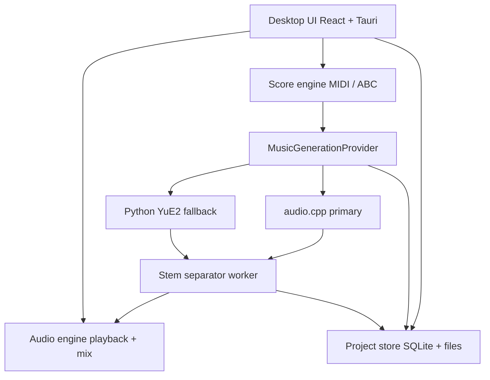
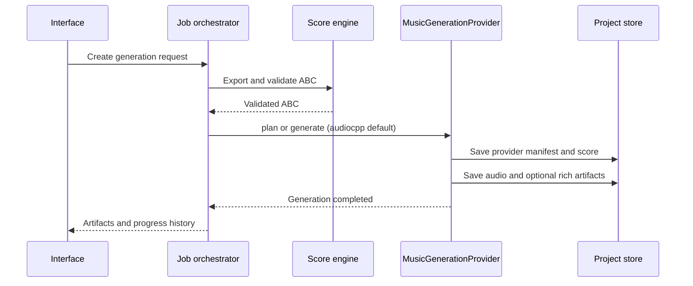
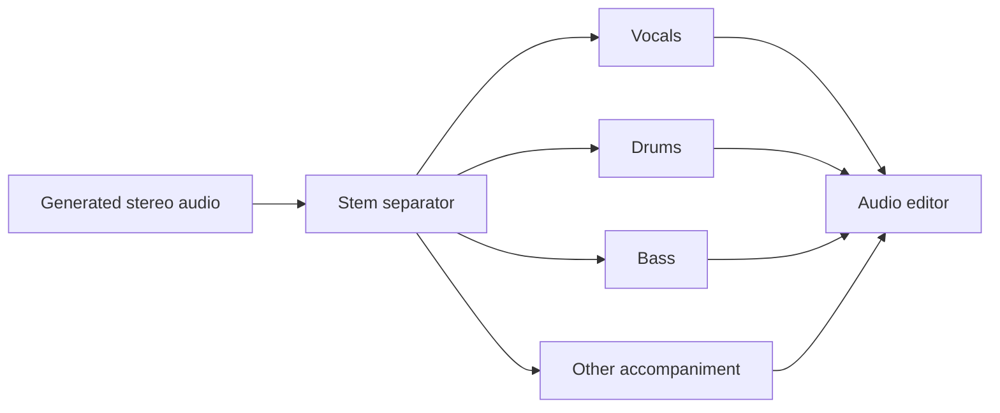
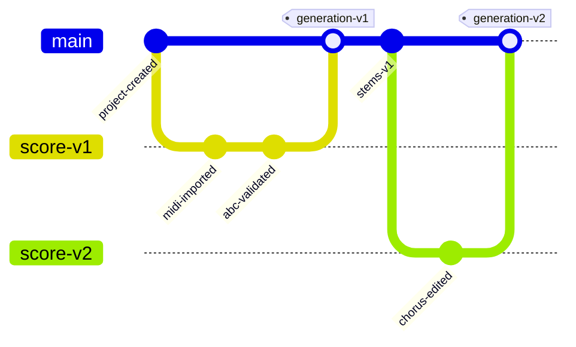

# Song Maker — Spécification produit et technique

**Version :** 0.2  
**Statut :** proposition de conception  
**Cible :** application desktop de création musicale assistée par IA  
**Famille de modèles :** YuE2-3B (upstream `m-a-p/YuE2-3B`)  
**Moteur d’inférence primaire :** [audio.cpp](https://github.com/0xShug0/audio.cpp) + GGUF [`audio-cpp/Yue2-3B-GGUF`](https://huggingface.co/audio-cpp/Yue2-3B-GGUF)  
**Moteur de référence / fallback :** runtime Python officiel YuE2  
**Principe :** composer en symboles, générer en audio, éditer en stems

## 1. Résumé exécutif

Song Maker est une application desktop permettant de créer un morceau à partir :

- d’un prompt décrivant le style musical ;
- de paroles structurées par sections ;
- d’une partition MIDI éditable ;
- d’un plan musical généré automatiquement par YuE2 ;
- d’une génération audio complète ensuite découpée en stems ;
- d’un éditeur audio multipiste permettant de mixer et d’exporter le morceau.

Le projet doit traiter la partition comme une source de vérité musicale versionnée. Le MIDI est le format de travail de l’utilisateur, mais YuE2 attend une partition au format ABC lorsqu’une composition symbolique est fournie. Song Maker doit donc maintenir une représentation musicale interne et convertir le MIDI vers un ABC compatible YuE2.

La génération audio doit passer par un contrat `MusicGenerationProvider` interchangeable. **Le provider par défaut est audio.cpp** (binaire C++/ggml, poids GGUF, sans dépendance Python). Le runtime Python officiel YuE2 reste disponible comme provider de référence pour comparer la qualité, reproduire les artefacts upstream et servir de fallback si une fonctionnalité n’est pas encore exposée par audio.cpp.

Le morceau complet généré est ensuite envoyé à un séparateur audio externe. Les stems obtenus — au minimum voix, batterie, basse et accompagnement — sont importés dans l’éditeur audio comme des pistes alignées sur la même timeline.

## 2. Capacités YuE2 et moteur d’inférence

### 2.1 Capacités produit communes (famille YuE2)

Les éléments suivants sont des contraintes d’intégration vérifiées dans la documentation publique YuE2 et dans le packaging audio.cpp :

- YuE2 génère un morceau complet à partir de paroles et d’un prompt de style, avec voix et accompagnement.
- YuE2 peut produire un plan symbolique éditable contenant la mélodie et les accords.
- Une partition ABC personnalisée peut être fournie en mode `cot="full"` ou `cot="melody"`.
- Le mode `cot="off"` permet une génération directe, mais ne produit pas de partition ABC éditable.
- La génération standard produit de l’audio stéréo (référence amont 48 kHz ; le provider doit documenter le sample rate effectif de sa sortie).
- Les stems séparés ne font pas partie des artefacts générés nativement. La séparation est donc une étape externe.
- YuE2 ne fournit pas d’argument natif pour l’inpainting audio local, l’alignement phonémique ou la référence audio directe. Une modification de partition régénère un nouveau morceau complet.

### 2.2 Moteur primaire : audio.cpp + GGUF

audio.cpp est le chemin d’intégration recommandé pour le MVP et pour tout déploiement local ou intégration type OS (packs GGUF + binaire, sans Python) :

- famille CLI : `--family yue2`, tâche `--task gen` ;
- poids principaux : `yue2-3b-bf16.gguf`, `yue2-3b-q8_0.gguf`, `yue2-3b-q4_0.gguf` ;
- VAE : `yue2-vae-f32.gguf`, `yue2-vae-f16.gguf` ;
- sidecars : config modèle, config de génération, tokenizer Qwen (`yue2-qwen.tiktoken`), config VAE ;
- options de requête déjà démontrées : `style`, `cot`, `abc_file`, `seed`, `num_inference_steps` ;
- backend CUDA documenté pour les demos publiques ;
- une seule requête musique lourde par GPU doit rester le comportement de référence.

Ordres de grandeur VRAM publiés (audio.cpp server, RTX 5090, exemple longform `tonight-awake`) :

| Combo | Peak VRAM indicatif |
|---|---|
| BF16 main + F32 VAE | ~12,5 Go |
| Q8_0 main + F16 VAE | ~8,9 Go |
| Q4_0 main + F16 VAE | ~7,8 Go |

Le MVP doit cibler **Q4_0 ou Q8_0 + VAE F16** comme configurations locales recommandées, et réserver BF16 aux machines à VRAM confortable ou aux benchmarks qualité.

Maturité : le support Yue2 dans audio.cpp est publié pour tests communautaires (branche `dev` au moment de la rédaction). Song Maker doit épingler une révision de binaire et de poids, vérifier les hashes, et traiter les écarts de qualité vs Python comme des bugs de provider, pas comme des surprises produit.

Sources : [audio.cpp](https://github.com/0xShug0/audio.cpp), [Yue2-3B-GGUF](https://huggingface.co/audio-cpp/Yue2-3B-GGUF).

### 2.3 Moteur de référence / fallback : Python YuE2

Le runtime Python officiel reste le provider de référence :

- pipeline documenté : `plan()` → `generate_semantic()` → `synthesize()` → `decode()` ;
- artefacts riches : `audio.flac`, `score.abc`, `plan.json`, tokens sémantiques, latents acoustiques, configuration effective ;
- environnement historique : Linux, Python, GPU NVIDIA BF16, souvent cité autour de ~24 Go de VRAM pour le chemin non quantifié.

Il sert à :

- valider qu’un ABC Song Maker est accepté par l’upstream ;
- comparer audio / plan / artefacts entre providers ;
- reprendre un décodage depuis latents quand audio.cpp ne l’expose pas encore ;
- dépanner une régression audio.cpp.

Il n’est **pas** le chemin d’installation par défaut du MVP.

Sources : [dépôt officiel YuE2](https://github.com/multimodal-art-projection/YuE), [guide de génération](https://github.com/multimodal-art-projection/YuE/blob/main/docs/generation.md), [modèle YuE2-3B](https://huggingface.co/m-a-p/YuE2-3B).

## 3. Vision produit

### 3.1 Promesse

> Song Maker transforme une intention musicale en composition éditable, puis en production audio manipulable.

### 3.2 Différenciation

Song Maker ne doit pas être uniquement une interface de prompt. L’utilisateur doit pouvoir :

1. préparer ou corriger la structure musicale avant la génération ;
2. comprendre ce que YuE2 va jouer ;
3. conserver toutes les versions de la partition et de l’audio ;
4. récupérer un résultat multipiste exploitable ;
5. comparer plusieurs interprétations d’une même composition.

### 3.3 Public cible

- musiciens et auteurs-compositeurs ;
- producteurs débutants souhaitant contrôler la structure d’un morceau ;
- créateurs de contenus ayant besoin de musique originale ;
- utilisateurs expérimentés souhaitant prototyper rapidement une composition ;
- développeurs ou agents capables d’éditer une partition et de produire plusieurs variantes.

## 4. Objectifs et périmètre

### 4.1 Objectifs du MVP

- créer un projet musical local ;
- saisir un style et des paroles ;
- importer un fichier MIDI ;
- visualiser et éditer la partition sur un piano roll ;
- convertir la partition vers un ABC compatible YuE2 ;
- lancer une génération via audio.cpp (provider YuE2 GGUF) avec plan symbolique quand `cot` le permet ;
- sauvegarder tous les artefacts de génération ;
- séparer le morceau en stems ;
- importer automatiquement les stems dans l’éditeur audio ;
- éditer le volume, le panoramique, le mute, le solo, la position et les fondus ;
- lire et exporter le mix final ;
- conserver l’historique des versions.

### 4.2 Hors périmètre du MVP

- génération de plugins VST/AU ;
- remplacement local d’une seule phrase audio sans régénérer le morceau complet ;
- conservation garantie de l’identité d’un chanteur ;
- alignement phonémique échantillon par échantillon ;
- édition spectrale avancée ;
- mastering automatique professionnel ;
- collaboration temps réel ;
- synchronisation cloud obligatoire ;
- distribution commerciale du modèle sans validation de licence.

## 5. Parcours utilisateur principal


### 5.1 Parcours recommandé

1. L’utilisateur crée un projet.
2. Il renseigne le titre, le style, la langue, le tempo souhaité et les paroles.
3. Il importe un MIDI ou crée une mélodie dans le piano roll.
4. Song Maker analyse les pistes MIDI et propose une répartition : mélodie, harmonie, basse, accompagnement.
5. L’utilisateur corrige la partition, les mesures et les sections.
6. Song Maker affiche un aperçu de la partition qui sera transmise à YuE2.
7. L’utilisateur lance la génération.
8. Le provider (audio.cpp par défaut) crée le plan symbolique lorsqu’il est disponible, puis l’audio stéréo.
9. L’utilisateur écoute le morceau généré et peut accepter, comparer ou modifier la partition.
10. Il lance la séparation en stems.
11. Les stems sont importés dans l’éditeur multipiste.
12. L’utilisateur ajuste le mix et exporte un fichier WAV, FLAC ou MP3.

## 6. Architecture fonctionnelle



### 6.1 Composants

#### Desktop shell

Responsabilités :

- fenêtre native ;
- gestion du projet courant ;
- accès aux fichiers locaux ;
- lancement et supervision des workers ;
- communication avec le frontend ;
- notifications de progression ;
- raccourcis clavier et gestion des appareils MIDI.

Technologie recommandée : **Tauri 2**.

#### Frontend

Responsabilités :

- bibliothèque de projets ;
- formulaire de création ;
- piano roll ;
- éditeur de partitions ;
- timeline audio ;
- gestion des versions ;
- affichage des erreurs et de la progression.

Technologies recommandées : **React, TypeScript, Vite, Zustand ou équivalent**, avec rendu canvas/WebGL pour le piano roll et les waveforms denses.

#### Score engine

Responsabilités :

- import et export MIDI ;
- représentation musicale interne ;
- édition des notes ;
- quantification ;
- gestion du tempo, de la métrique, de la tonalité et des sections ;
- conversion vers ABC ;
- validation du fichier ABC ;
- comparaison de deux partitions ;
- conversion d’une partition YuE2 vers MIDI.

Le score engine ne doit pas utiliser l’ABC comme seule source de vérité. L’ABC est un format d’échange avec YuE2 ; la représentation interne doit conserver les informations nécessaires à une édition MIDI propre.

#### Music generation worker

Responsabilités :

- exposer le contrat `MusicGenerationProvider` ;
- lancer le provider sélectionné (audio.cpp par défaut, Python YuE2 en option) ;
- charger et maintenir le modèle ou le processus d’inférence selon le provider ;
- exécuter planification et génération selon les capacités du provider ;
- exposer la progression ;
- enregistrer les artefacts complets et le manifeste provider ;
- vérifier les versions de binaire, de modèle GGUF / poids amont et de VAE ;
- reprendre une étape déjà sauvegardée lorsque le provider le permet ;
- ne jamais écraser une génération existante.

##### Provider `audiocpp` (primaire)

- binaire `audiocpp_cli` (ou serveur audio.cpp) isolé du shell UI ;
- packs GGUF + sidecars sous un cache modèles versionné ;
- invocation typique : `--task gen --family yue2` avec `style`, `cot`, `abc_file`, `seed`, `num_inference_steps`, `yue2.model_gguf`, `yue2.vae_gguf` ;
- sortie audio normalisée vers le dossier de génération du projet ;
- journalisation de la ligne de commande effective (sans secrets) et des révisions épinglées.

##### Provider `yue2-python` (référence / fallback)

- processus Python séparé afin qu’un crash CUDA ou une erreur d’environnement n’abatte pas l’éditeur ;
- conservation des artefacts riches upstream (latents, tokens, `plan.json`, etc.) ;
- activation explicite dans les paramètres avancés, pas au first-run.

Le worker UI-facing reste un processus séparé du desktop shell dans tous les cas.

#### Stem separator worker

Responsabilités :

- recevoir l’audio stéréo généré ;
- appliquer un séparateur configurable ;
- produire les stems et leurs métadonnées ;
- conserver le modèle, la version et les paramètres utilisés ;
- normaliser le sample rate du projet ;
- détecter les fichiers incomplets ou écrêtés ;
- importer automatiquement les pistes résultantes.

Pour le premier adaptateur, un modèle de séparation de type Demucs peut être utilisé. Demucs fournit notamment des sorties `vocals`, `drums`, `bass` et `other`, mais son dépôt principal est archivé et n’est plus activement maintenu. L’architecture doit donc isoler ce composant derrière une interface `StemSeparatorProvider` afin de pouvoir remplacer le moteur ultérieurement. Voir [dépôt Demucs](https://github.com/facebookresearch/demucs).

#### Audio engine

Responsabilités :

- lecture multipiste synchronisée ;
- rendu des waveforms ;
- mixage temps réel ;
- gain, panoramique, mute et solo ;
- fondus ;
- boucle de lecture ;
- export offline ;
- pré-écoute MIDI avec un instrument de démonstration.

Pour le MVP, une combinaison Web Audio API/AudioWorklet dans la vue Tauri est suffisante. Le rendu final doit être effectué offline avec un moteur déterministe, par exemple FFmpeg et/ou un moteur audio natif dédié.

## 7. Modèle musical interne

### 7.1 `ScoreDocument`

```ts
type ScoreDocument = {
  id: string;
  version: number;
  ppq: number;                 // recommandé : 960
  tempoMap: TempoEvent[];
  timeSignatures: TimeSignatureEvent[];
  keySignatures: KeySignatureEvent[];
  sections: SongSection[];
  voices: ScoreVoice[];
  chordEvents: ChordEvent[];
  lyricAnchors: LyricAnchor[];
  source: "midi" | "abc" | "generated" | "manual";
  sourceFileHash?: string;
};

type ScoreVoice = {
  id: string;
  name: string;
  role: "vocal" | "melody" | "harmony" | "bass" | "accompaniment" | "other";
  notes: NoteEvent[];
};

type NoteEvent = {
  id: string;
  startTick: number;
  durationTick: number;
  pitch: number;
  velocity: number;
  tieStart?: boolean;
  tieEnd?: boolean;
};
```

### 7.2 Règles de conversion MIDI

À l’import :

- lire toutes les pistes et canaux ;
- récupérer le tempo, la métrique et la tonalité lorsqu’ils sont présents ;
- convertir les ticks MIDI vers le PPQ interne ;
- regrouper les notes par rôle musical ;
- conserver les pistes originales sans modification ;
- proposer une quantification, mais ne jamais l’appliquer silencieusement ;
- signaler les notes superposées, les canaux ambigus et les changements de tempo ;
- demander à l’utilisateur quelle piste représente la mélodie principale si la détection est incertaine.

### 7.3 Profils d’export ABC

Song Maker doit produire au minimum deux profils :

#### Profil `full`

À utiliser quand la partition contient la mélodie et l’harmonie. Le système conserve les accords lorsque le dialecte ABC et le mode YuE2 choisi les acceptent.

#### Profil `melody`

À utiliser quand seule la mélodie doit être imposée et que YuE2 doit générer librement l’accompagnement. Le fichier est chord-free lorsque cela est requis par le workflow YuE2.

La documentation YuE2 indique que l’entrée mélodique native utilise les voix `Vocal` et `Ins`, et que les dialectes ABC arbitraires peuvent nécessiter une conversion. L’exporteur doit donc être accompagné d’un validateur dédié, avec des tests basés sur les exemples officiels.

### 7.4 Validation ABC

Avant chaque génération :

- vérifier la présence d’un en-tête valide ;
- vérifier la métrique et le tempo ;
- vérifier que les mesures sont complètes ;
- vérifier les voix attendues ;
- détecter les notes hors plage raisonnable ;
- vérifier les silences, liaisons et altérations ;
- produire un aperçu MIDI ou piano roll ;
- stocker le fichier ABC exact envoyé à YuE2.

## 8. Génération YuE2

### 8.0 Contrat provider

```ts
type MusicGenerationProviderId = "audiocpp" | "yue2-python";

type MusicGenerationRequest = {
  provider: MusicGenerationProviderId;
  title: string;
  style: string;
  lyricsPath: string;
  scoreAbcPath?: string;
  compositionMode: "full" | "melody" | "off";
  cot: "full" | "melody" | "off";
  seed?: number;
  candidateCount: number;
  /** Pack ou identifiants de poids épinglés */
  modelPack: string;
  modelRevision: string;
  vaePack: string;
  vaeRevision: string;
  /** audio.cpp */
  quant?: "bf16" | "q8_0" | "q4_0";
  vaePrecision?: "f32" | "f16";
  numInferenceSteps?: number;
  backend?: "cuda" | "cpu";
};
```

Règles :

- le MVP crée les jobs avec `provider: "audiocpp"` ;
- `yue2-python` n’est proposé que s’il est installé et explicitement choisi ;
- chaque génération enregistre `provider`, révisions, hashes GGUF / poids, binaire (`audiocpp` version) et options effectives ;
- un même projet peut contenir des générations de providers différents ; le comparateur d’écoute doit l’afficher.

### 8.1 Modes de génération

| Mode produit | Entrées | Mode YuE2 | Résultat |
|---|---|---|---|
| Création guidée | style + paroles | `cot="full"` | plan mélodie/accords + audio |
| Création à partir d’une mélodie | style + paroles + MIDI mélodique | `cot="melody"` | mélodie imposée + accompagnement libre |
| Création à partir d’une partition complète | style + paroles + MIDI complet | `cot="full"` | composition contrainte + audio |
| Génération libre | style + paroles | `cot="off"` | audio sans score éditable |
| Réinterprétation | audio transcrit + style + nouvelles paroles | `cot="melody"` | nouvelle interprétation |

Le MVP doit privilégier les trois premiers modes via audio.cpp. Le mode `off` doit être présenté comme une option avancée, car il retire la possibilité d’éditer la partition produite.

### 8.2 Paramètres utilisateur

#### Obligatoires

- titre du morceau ;
- prompt de style ;
- paroles ou texte explicitement marqué comme instrumental ;
- langue ;
- mode de composition ;
- source musicale : nouvelle composition, MIDI ou partition existante.

#### Optionnels

- tempo cible ;
- tonalité ;
- métrique ;
- instruments ;
- caractère vocal ;
- structure : intro, couplet, pré-refrain, refrain, pont, outro ;
- seed ;
- nombre de candidats ;
- modèle et révision / pack GGUF ;
- VAE et révision / précision ;
- provider (`audiocpp` ou `yue2-python`) ;
- quantification et `num_inference_steps` (audio.cpp) ;
- échelle de guidage, exposée uniquement dans les paramètres avancés du provider Python.

### 8.3 Structure des paroles

Les paroles doivent être stockées avec leurs balises de section :

```text
[Verse 1]
...

[Pre-Chorus]
...

[Chorus]
...

[Bridge]
...
```

Les notes d’implémentation ne doivent jamais être mélangées aux paroles envoyées au modèle.

### 8.4 Pipeline technique



### 8.5 Conservation des artefacts

Chaque génération doit être enregistrée dans un dossier propre. Le système ne doit jamais modifier une génération précédente.

Artefacts attendus :

- requête complète ;
- provider et révisions (binaire audio.cpp ou runtime Python) ;
- prompt de style ;
- paroles ;
- MIDI source ;
- `score.abc` transmis au moteur ;
- `plan.json` lorsque le provider le produit ;
- tokens sémantiques / latents lorsqu’ils existent (surtout provider Python) ;
- audio généré (`audio.wav` / `audio.flac`) ;
- configuration effective ;
- identifiants et hashes des GGUF ou poids amont ;
- seed ;
- durées d’exécution ;
- logs ;
- résultat de validation ;
- hash de chaque fichier.

### 8.6 Candidats multiples

Une génération produit un candidat par appel. Song Maker peut proposer un mode `Generate 4 candidates`, mais les appels doivent être exécutés séquentiellement sur un GPU donné. Le produit doit afficher les quatre résultats côte à côte dans un comparateur d’écoute, sans sélectionner automatiquement un gagnant sur la seule base d’une métrique arbitraire.

## 9. Séparation en stems

### 9.1 Principe

YuE2 produit le morceau complet (via audio.cpp ou Python). Song Maker ajoute donc une étape de séparation :



### 9.2 Stems MVP

- `vocals` ;
- `drums` ;
- `bass` ;
- `other`.

Des séparations additionnelles comme `guitar` et `piano` peuvent être proposées dans une version expérimentale, mais doivent être marquées comme moins fiables lorsqu’elles utilisent un modèle connu pour produire davantage de bleed ou d’artefacts.

### 9.3 Contrat de séparation

```ts
type StemSeparatorRequest = {
  inputAudioPath: string;
  projectSampleRate: 48000;
  provider: string;
  model: string;
  device: "cuda" | "cpu";
  outputFormat: "wav";
};

type StemSeparatorResult = {
  inputHash: string;
  provider: string;
  model: string;
  sampleRate: number;
  stems: Array<{
    role: "vocals" | "drums" | "bass" | "other" | "guitar" | "piano";
    path: string;
    durationMs: number;
    peakDb: number;
    hash: string;
    warnings: string[];
  }>;
};
```

### 9.4 Règles d’import dans l’éditeur

- tous les stems doivent commencer au même timecode ;
- tous les stems doivent avoir la même durée logique ;
- les fichiers doivent être resamplés vers le sample rate du projet ;
- les canaux doivent être conservés en stéréo lorsque disponibles ;
- les fichiers sources doivent être conservés ;
- les stems doivent porter un indicateur `AI separated` ;
- l’interface doit afficher un avertissement sur le bleed et les artefacts ;
- l’utilisateur doit pouvoir relancer la séparation avec un autre provider sans perdre le premier résultat.

### 9.5 Limite produit à afficher

La séparation ne reconstruit pas les pistes originales du modèle. Elle produit des estimations audio susceptibles de contenir des fuites entre instruments, des artefacts de phase et des transitoires dégradés. Toute fonction d’édition ou d’export doit traiter cette information comme une propriété du résultat.

## 10. Éditeur audio multipiste

### 10.1 Pistes

Chaque stem devient une piste audio avec :

- nom ;
- couleur ;
- icône de rôle ;
- waveform ;
- gain ;
- panoramique ;
- mute ;
- solo ;
- verrouillage ;
- indicateur de séparation IA ;
- menu d’actions ;
- niveau crête et niveau RMS optionnel.

### 10.2 Édition MVP

- lecture et pause ;
- navigation dans la timeline ;
- zoom horizontal ;
- snap sur mesures, temps ou grille libre ;
- sélection de clips ;
- déplacement ;
- découpe ;
- suppression ;
- duplication ;
- trim ;
- fondu d’entrée et de sortie ;
- volume de clip ;
- gain de piste ;
- panoramique ;
- mute et solo ;
- boucle de lecture ;
- marqueurs de sections ;
- export du mix.

### 10.3 Fonctions post-MVP

- automation de volume et de panoramique ;
- égaliseur simple ;
- compresseur simple ;
- réverbération ;
- effets par piste ;
- sidechain ;
- synchronisation avec la partition ;
- édition par conversation ;
- remplacement d’une section par une nouvelle génération puis crossfade manuel.

### 10.4 Lecteur principal

Le lecteur global doit afficher :

- morceau courant ;
- bouton lecture/pause ;
- précédent/suivant ;
- durée courante et durée totale ;
- timeline ;
- boucle ;
- volume master ;
- compteur de lecture ;
- sortie audio sélectionnée.

## 11. Éditeur de partition

### 11.1 Modes d’affichage

- piano roll ;
- vue partition simplifiée ;
- liste des événements ;
- vue ABC pour utilisateurs avancés ;
- comparaison avant/après.

### 11.2 Opérations

- ajouter, supprimer et déplacer une note ;
- modifier hauteur, durée et vélocité ;
- quantifier ;
- transposer ;
- modifier le tempo ;
- modifier la tonalité ;
- modifier la métrique ;
- ajouter ou déplacer une section ;
- modifier les accords ;
- changer le rôle d’une voix ;
- jouer la sélection avec un instrument MIDI de pré-écoute ;
- exporter MIDI ;
- exporter ABC ;
- générer une nouvelle version YuE2 à partir de la partition.

### 11.3 Invariants d’édition

Avant une régénération, l’utilisateur peut choisir le niveau de conservation demandé :

- conserver exactement les hauteurs ;
- conserver hauteurs et rythmes ;
- conserver uniquement le contour mélodique ;
- autoriser une adaptation mélodique limitée ;
- autoriser la réharmonisation ;
- autoriser le changement de tempo ;
- autoriser le changement de structure.

Ces invariants doivent être vérifiés sur les événements musicaux, et non par une simple comparaison de texte ABC.

## 12. Versioning et historique

### 12.1 Règle fondamentale

Toute modification significative crée une nouvelle version :

- changement de prompt ;
- changement de paroles ;
- changement de partition ;
- changement de paramètres YuE2 ;
- nouvelle génération ;
- nouvelle séparation de stems ;
- modification importante du mix.

### 12.2 Graphe de versions



Le projet doit toujours pouvoir répondre à ces questions :

- quel prompt a produit cette version ?
- quelles paroles ont été utilisées ?
- quelle partition exacte a été envoyée ?
- quelle version du provider, du binaire et des GGUF / poids a été utilisée ?
- quelle séparation a produit ces stems ?
- quel mix final dérive de quels stems ?

## 13. Stockage local

### 13.1 Format de projet

Le format de projet recommandé est un dossier local ou une archive `.songmaker` contenant :

```text
MySong.songmaker/
├── project.json
├── database.sqlite
├── scores/
│   ├── source-v001.mid
│   ├── score-v001.json
│   ├── score-v001.abc
│   └── score-v002.mid
├── generations/
│   ├── gen-001/
│   │   ├── request.json
│   │   ├── lyrics.txt
│   │   ├── score.abc
│   │   ├── plan.json
│   │   ├── audio.flac
│   │   ├── latent.npy
│   │   ├── result.json
│   │   └── checksums.json
├── separations/
│   └── sep-001/
│       ├── vocals.wav
│       ├── drums.wav
│       ├── bass.wav
│       ├── other.wav
│       └── separation.json
├── mixes/
│   └── mix-v001.json
├── previews/
└── logs/
```

Les gros fichiers audio ne doivent pas être stockés directement en BLOB SQLite. SQLite conserve les métadonnées, les relations, les états de jobs et les chemins relatifs.

### 13.2 Intégrité

- hash SHA-256 des entrées et sorties ;
- vérification avant reprise d’une étape ;
- écriture atomique via fichiers temporaires ;
- journal append-only des jobs ;
- aucune suppression automatique d’une génération utilisée par une version ;
- possibilité d’archiver une version sans la détruire.

## 14. Orchestration des jobs

### 14.1 États d’un job

```text
queued
preparing
validating_score
planning
generating
decoding
generated
separating
stems_ready
importing_tracks
completed
cancelled
failed
```

Les étapes `planning` / `generating` / `decoding` doivent être mappées aux capacités réelles du provider. audio.cpp peut exposer une progression plus coarse-grained qu’un pipeline Python à quatre phases ; l’UI affiche alors un état indéterminé explicite plutôt qu’une fausse granularité.

### 14.2 Événements

```ts
type JobEvent = {
  jobId: string;
  projectId: string;
  stage: string;
  status: "started" | "progress" | "artifact" | "completed" | "failed";
  progress?: number;
  message?: string;
  artifactPath?: string;
  timestamp: string;
};
```

La progression doit être visible dans l’application et rester disponible après redémarrage. Une génération longue ne doit jamais bloquer l’éditeur audio ou le changement d’écran.

### 14.3 Reprise

- une étape terminée doit être marquée dans `result.json` ;
- les latents sauvegardés peuvent être décodés sans régénérer le morceau lorsque le provider le permet (surtout Python) ;
- un échec CUDA doit rendre l’état et les logs consultables ;
- une annulation ne doit pas supprimer les artefacts déjà créés ;
- toute modification de score doit créer un nouveau dossier de génération.

## 15. API interne proposée

### 15.1 Création de génération

```http
POST /api/projects/{projectId}/generations
```

```json
{
  "title": "Midnight Signal",
  "style": "English synthwave, warm female vocal, analog bass, gated drums, 112 BPM",
  "lyricsPath": "lyrics-v002.txt",
  "scorePath": "scores/score-v003.abc",
  "compositionMode": "full",
  "cot": "full",
  "seed": 42,
  "candidateCount": 1,
  "provider": "audiocpp",
  "modelPack": "audio-cpp/Yue2-3B-GGUF",
  "modelRevision": "pinned-revision",
  "modelGguf": "yue2-3b-q8_0.gguf",
  "vaeGguf": "yue2-vae-f16.gguf",
  "quant": "q8_0",
  "vaePrecision": "f16",
  "numInferenceSteps": 8,
  "backend": "cuda"
}
```

Pour le provider Python de référence, les champs `model` / `vae` amont (`m-a-p/YuE2-3B`, `m-a-p/YuE2-Vae`) remplacent les GGUF.
### 15.2 Endpoints principaux

```text
GET    /api/projects
POST   /api/projects
GET    /api/projects/:id
POST   /api/projects/:id/import-midi
GET    /api/projects/:id/scores/:version
PUT    /api/projects/:id/scores/:version
POST   /api/projects/:id/scores/:version/export-abc
POST   /api/projects/:id/generations
GET    /api/projects/:id/generations/:generationId
POST   /api/generations/:generationId/decode
POST   /api/generations/:generationId/separate
GET    /api/projects/:id/stems
POST   /api/projects/:id/mixes
POST   /api/projects/:id/export
GET    /api/jobs/:jobId/events
POST   /api/jobs/:jobId/cancel
```

## 16. Interface utilisateur

### 16.1 Navigation principale

Sidebar minimaliste :

- Bibliothèque ;
- Créer ;
- Paramètres ;
- état du worker GPU ;
- indicateur de job actif ;
- projet courant.

### 16.2 Écrans

1. **Splash screen** : nom Song Maker en fading sur fond sombre.
2. **Bibliothèque** : liste simple, liste détaillée ou grille.
3. **Nouveau morceau** : prompt, paroles, paramètres et aperçu de la partition.
4. **Score editor** : piano roll et édition MIDI.
5. **Generation monitor** : étapes du provider (audio.cpp ou Python) et artefacts produits.
6. **Candidate comparison** : comparaison de plusieurs générations.
7. **Stem separation** : choix du provider, modèle, stems attendus et avertissements.
8. **Audio editor** : timeline, pistes, waveforms, contrôles et player.
9. **Version history** : graphe ou liste des versions avec comparaison.
10. **Settings** : modèles, GPU, chemins, sample rate, cache, export et confidentialité.

### 16.3 Écran de création recommandé

Répartition desktop :

- 28 à 32 % à gauche : prompt, paroles, tempo, tonalité, mode et bouton de génération ;
- 68 à 72 % à droite : partition, arrangement, pistes, paramètres audio et player ;
- panneau redimensionnable ;
- possibilité de passer en mode partition plein écran avant génération ;
- possibilité de réduire l’éditeur de score pour afficher davantage de pistes.

### 16.4 États obligatoires

Chaque écran doit prévoir :

- état vide ;
- chargement ;
- progression ;
- succès ;
- avertissement ;
- erreur récupérable ;
- job annulé ;
- GPU indisponible ;
- fichier corrompu ;
- modèle non téléchargé ;
- licence non validée pour l’usage demandé.

## 17. Paramètres système

### 17.1 Moteur de génération

- provider par défaut : `audiocpp` ;
- chemin du binaire audio.cpp / `audiocpp_cli` ;
- chemin du cache des packs GGUF et sidecars ;
- pack modèle (`audio-cpp/Yue2-3B-GGUF` ou miroir) ;
- fichier GGUF principal et quantification ;
- fichier GGUF VAE et précision ;
- révision épinglée et hashes ;
- GPU / backend utilisé ;
- `num_inference_steps` par défaut ;
- mode offline ;
- nombre maximum de candidats ;
- conservation automatique des logs ;
- provider optionnel `yue2-python` : chemin runtime, cache Hugging Face, révisions amont.

### 17.2 Moteur de séparation

- provider ;
- modèle ;
- device CUDA/CPU ;
- nombre de sources ;
- taille de segment ;
- format de sortie ;
- resampling ;
- conservation des séparations précédentes.

### 17.3 Audio

- sample rate projet : 48 kHz par défaut ;
- profondeur interne float32 ;
- sortie stéréo ;
- périphérique audio ;
- taille du buffer ;
- limite de crête ;
- dossier des projets ;
- dossier temporaire ;
- dossier des caches lourds.

## 18. Déploiement recommandé

### 18.1 Mode local GPU (chemin MVP)

```text
Song Maker desktop
       │
       ├── Tauri + React
       ├── audio.cpp (Yue2 GGUF) local
       ├── separator worker local
       └── stockage local
```

Ce mode est le déploiement de référence. Il cible un GPU NVIDIA CUDA avec une VRAM compatible avec le pack choisi (indicativement ≥ 8 Go pour Q4_0 + VAE F16, davantage pour Q8/BF16). Windows et Linux doivent être validés avec le même binaire audio.cpp et les mêmes hashes de packs ; WSL2 n’est plus un prérequis du MVP tant que CUDA native fonctionne.

### 18.2 Mode worker GPU distant

```text
Desktop app ── HTTPS/WebSocket ── GPU worker
      │                              │
      └── projets locaux              ├── audio.cpp (+ option Python)
                                     ├── separation
                                     └── artifacts temporaires
```

Le mode distant reste optionnel pour les machines sans GPU suffisant ou pour mutualiser un serveur. Les fichiers doivent être chiffrés en transit, supprimés selon une politique claire et jamais téléversés sans consentement explicite.

### 18.3 Provider Python optionnel

Le runtime Python YuE2 peut être installé à part pour les utilisateurs avancés. Il ne doit pas bloquer le first-run ni le parcours MVP.

### 18.4 Installation des modèles

Le premier lancement doit proposer :

- vérification du GPU et de la VRAM ;
- recommandation de pack (Q4 / Q8 / BF16) selon la VRAM détectée ;
- téléchargement du binaire audio.cpp et des GGUF + sidecars ;
- validation des hashes ;
- test court `cot=off` puis, si possible, un test `cot=full` ou `cot=melody` ;
- affichage de l’espace disque requis ;
- affichage de la licence applicable (CC BY-NC sur les poids).

Le système ne doit pas réduire silencieusement la qualité ou raccourcir une génération pour masquer une erreur de mémoire. Il doit expliquer le problème et proposer un autre pack (quantification plus agressive), un autre worker, ou le provider Python s’il est disponible.

### 18.5 Intégration type OS / packs (hors shell DAW)

Lorsque Song Maker est exposé comme service dans un hôte agentique (ex. Akasha OS), le même contrat s’applique :

- pack GGUF + sidecars dans un catalogue de modèles ;
- binaire audio.cpp installé à côté des autres moteurs média ;
- API de génération musique distincte du TTS ;
- UI DeclUI / Create-like pour prompt, paroles, cot, job et historique ;
- piano roll et éditeur multipiste restent hors de ce premier contrat d’intégration.

## 19. Sécurité, confidentialité et licences

### 19.1 Confidentialité

- fonctionnement local-first ;
- aucun envoi automatique des prompts, paroles, MIDI ou audio ;
- consentement avant usage d’un worker distant ;
- chiffrement optionnel des projets ;
- effacement contrôlé des caches ;
- journal local des opérations ;
- séparation des secrets et des métadonnées de projet.

### 19.2 Licences à traiter avant commercialisation

Le code YuE2 amont est annoncé sous Apache-2.0, mais les poids YuE2-3B / YuE2-VAE et le package GGUF [`audio-cpp/Yue2-3B-GGUF`](https://huggingface.co/audio-cpp/Yue2-3B-GGUF) restent sous **CC BY-NC 4.0** (même contrainte que l’upstream). La documentation du projet indique que l’usage commercial par des entreprises nécessite un échange avec les auteurs. SheetSage2 est également affiché avec une licence CC BY-NC 4.0. Demucs est sous MIT, mais son dépôt principal est archivé. audio.cpp est un moteur d’inférence séparé : sa licence binaire/code doit être vérifiée et affichée distinctement des poids.

Conséquence :

- un prototype personnel peut être développé avec ces composants en respectant leurs conditions ;
- une distribution commerciale de Song Maker avec les poids embarqués ne doit pas être annoncée avant validation juridique ;
- l’application doit séparer le code, le binaire audio.cpp, les poids GGUF et les composants tiers ;
- un écran “Licenses and model usage” doit être inclus ;
- les versions et licences doivent être enregistrées dans chaque génération.

Références : [licence et conditions YuE2](https://github.com/multimodal-art-projection/YuE/blob/main/MODEL_LICENSE), [modèle YuE2-3B](https://huggingface.co/m-a-p/YuE2-3B), [Yue2-3B-GGUF](https://huggingface.co/audio-cpp/Yue2-3B-GGUF), [SheetSage2](https://huggingface.co/m-a-p/SheetSage2), [Demucs](https://github.com/facebookresearch/demucs), [audio.cpp](https://github.com/0xShug0/audio.cpp).

## 20. Exigences non fonctionnelles

### Performance

- l’interface reste interactive pendant les jobs ;
- aucun traitement GPU dans le thread UI ;
- ouverture d’un projet de taille moyenne en moins de 3 secondes hors scan audio ;
- lecture multipiste synchronisée avec au moins 8 pistes audio de 48 kHz ;
- zoom et déplacement de la timeline fluides ;
- rendu des waveforms mis en cache ;
- séparation et génération affichent une progression réelle ou un état indéterminé explicite.

### Fiabilité

- reprise après redémarrage ;
- sauvegarde automatique du score ;
- écriture atomique des artefacts ;
- conservation des erreurs ;
- aucun écrasement silencieux ;
- migration versionnée du format de projet.

### Accessibilité

- raccourcis clavier pour lecture, pause, zoom, sauvegarde et génération ;
- focus visible ;
- contraste élevé ;
- tailles de zones cliquables suffisantes ;
- alternatives textuelles pour les icônes ;
- navigation clavier minimale dans les champs et contrôles.

## 21. Tests

### 21.1 Score engine

- import MIDI mono-piste ;
- import MIDI multi-piste ;
- tempo unique et tempo map ;
- changements de métrique ;
- notes liées ;
- silences ;
- polyphonie ;
- quantification ;
- transposition ;
- export MIDI round-trip ;
- export ABC validé par les exemples YuE2 ;
- comparaison exacte des invariants.

### 21.2 Music generation worker

- chargement du pack GGUF et du binaire audio.cpp ;
- génération `cot=off`, `cot=full`, `cot=melody` ;
- génération avec `abc_file` ;
- épinglage de révision et vérification de hash ;
- interruption / annulation ;
- erreur CUDA / VRAM insuffisante ;
- modèle ou sidecar manquant ;
- reprise d’un résultat complet ;
- provider Python optionnel : planification seule, décodage depuis latents, comparaison audio vs audio.cpp ;
- vérification de présence des artefacts minimaux (audio + manifeste).

### 21.3 Séparation

- entrée WAV, FLAC et MP3 ;
- durée longue ;
- resampling ;
- modèle 4 sources ;
- modèle 6 sources expérimental ;
- reprise après échec ;
- alignement de tous les stems ;
- détection de clipping ;
- import automatique dans l’éditeur.

### 21.4 Éditeur audio

- lecture synchronisée ;
- mute/solo ;
- déplacement d’un clip ;
- découpe ;
- fondus ;
- volume ;
- panoramique ;
- boucle ;
- sauvegarde et restauration ;
- export mix stéréo ;
- export stems individuels.

## 22. Critères d’acceptation du MVP

Le MVP est accepté lorsque :

1. l’utilisateur peut créer un projet local sans compte ;
2. il peut importer un MIDI et visualiser ses notes ;
3. il peut modifier une note, le tempo et une section ;
4. le système peut exporter un ABC validé et afficher son aperçu ;
5. une génération audio.cpp (Yue2 GGUF) peut être lancée avec les paroles, le style et l’ABC ;
6. le projet conserve la requête, la partition exacte, l’audio, le manifeste provider et les artefacts disponibles ;
7. une génération modifiée crée une nouvelle version ;
8. un morceau généré peut être séparé en au moins quatre stems ;
9. les stems sont automatiquement alignés dans l’éditeur ;
10. l’utilisateur peut lire, mixer et exporter le résultat ;
11. un redémarrage ne détruit ni les jobs ni les versions ;
12. les erreurs de GPU, de modèle, de licence et de fichier sont explicites ;
13. l’application indique que les stems sont issus d’une séparation estimée ;
14. aucun traitement lourd ne bloque l’interface.

## 23. Roadmap proposée

### Phase 0 — Validation technique

- installer audio.cpp (révision `dev` ou release épinglée) et le pack [`audio-cpp/Yue2-3B-GGUF`](https://huggingface.co/audio-cpp/Yue2-3B-GGUF) ;
- rejouer au moins un demo officiel (`cot=off`, `cot=full`, `cot=melody` avec ABC) ;
- mesurer VRAM, durée, RTF et taille disque pour Q4_0 et Q8_0 ;
- importer un MIDI simple et convertir MIDI → ABC ;
- comparer optionnellement une même requête sur le runtime Python YuE2 ;
- tester le séparateur ;
- figer les hashes et la révision binaire retenues pour le MVP.

### Phase 1 — MVP vertical

- desktop shell ;
- bibliothèque ;
- formulaire prompt/paroles ;
- import MIDI ;
- piano roll minimal ;
- génération audio.cpp (Yue2 GGUF) ;
- séparation 4 stems ;
- lecture multipiste ;
- export WAV/FLAC.

### Phase 2 — Édition musicale sérieuse

- score engine interne complet ;
- gestion des accords ;
- sections et structure ;
- comparaison de partitions ;
- versions et branches ;
- candidats multiples ;
- export MIDI/ABC propre.

### Phase 3 — Production audio

- automation ;
- effets simples ;
- meilleure gestion du gain ;
- export stems ;
- présets de mix ;
- analyse de clipping et de loudness ;
- séparation provider interchangeable.

### Phase 4 — Agent et collaboration

- assistant d’édition de partition ;
- commandes comme “garde la mélodie du refrain et reharmonise les couplets” ;
- vérification des invariants ;
- comparaison audio avant/après ;
- worker GPU distant ;
- synchronisation optionnelle.

## 24. Décisions recommandées

1. Utiliser le MIDI comme format utilisateur et une représentation musicale interne comme source de vérité.
2. Convertir explicitement MIDI vers ABC avant génération ; ne pas prétendre que YuE2 accepte directement le MIDI.
3. Commencer par `cot="full"` et `cot="melody"` ; conserver `cot="off"` comme mode sans score.
4. Versionner le prompt, les paroles, la partition, la génération, la séparation et le mix indépendamment.
5. Utiliser **audio.cpp + Yue2 GGUF comme provider primaire** ; isoler un worker processus séparé du shell UI.
6. Conserver le runtime Python YuE2 comme provider de référence / fallback, jamais comme prérequis first-run.
7. Utiliser un adaptateur de séparation audio remplaçable, avec un premier provider Demucs-compatible.
8. Afficher clairement que les stems sont estimés et peuvent contenir des artefacts.
9. Prévoir un mode worker GPU distant pour les machines sous le seuil VRAM du pack choisi ; le local Q4/Q8 reste le chemin MVP.
10. Bloquer toute distribution commerciale des poids jusqu’à clarification de la licence YuE2 / GGUF et de celle de SheetSage2.
11. Construire le premier prototype autour d’un flux vertical complet avant d’investir dans les fonctions de DAW avancées.
12. Pour une intégration hôte agentique, exposer d’abord le service de génération (pack + binaire + jobs), pas le DAW.

## 25. Risques principaux

| Risque | Impact | Réponse |
|---|---|---|
| Support Yue2 audio.cpp encore en `dev` / instable | Élevé | épingler révision, tests de non-régression, fallback Python |
| Qualité Q4/Q8 inférieure au BF16 / Python | Moyen | packs multiples, comparateur, recommandation selon VRAM |
| ABC généré depuis MIDI incompatible | Élevé | exporter dédié, fixtures officielles et validateur |
| qualité variable des stems | Élevé | provider interchangeable, avertissements, conservation du mix original |
| dérive entre partition et audio | Élevé | nouvelle version à chaque édition, comparaison des événements |
| temps de génération important | Moyen | jobs asynchrones, cache, reprise et comparaison de candidats |
| licence des poids incompatible avec une distribution commerciale | Très élevé | validation juridique avant packaging ou vente |
| perte de données sur crash | Élevé | artefacts append-only, hashes, écritures atomiques |
| interface trop complexe pour un débutant | Moyen | parcours guidé et mode avancé repliable |
| GPU local insuffisant même en Q4 | Moyen | worker distant ou machine GPU dédiée |

## 26. Conclusion

La bonne abstraction pour Song Maker est un atelier de composition hybride : la partition contrôle l’intention musicale, un provider YuE2 réalise cette intention en audio, le séparateur transforme le morceau en matière éditable, puis l’éditeur multipiste permet la finition.

Le choix d’inférence le plus important pour le MVP est **audio.cpp + GGUF** : pas de Python obligatoire, packs quantifiés réalistes en VRAM, et même famille d’intégration que les moteurs média GGUF existants. Le runtime Python reste la référence qualité et le filet de sécurité.

Le choix architectural le plus important reste de ne pas lier l’interface au format de sortie d’un moteur. Le projet doit posséder son propre modèle musical, son propre système de versions et ses propres contrats d’artefacts. YuE2 — via audio.cpp ou Python — devient un moteur de rendu interchangeable, tandis que Song Maker conserve la maîtrise de la composition, de l’historique et du mix final.
