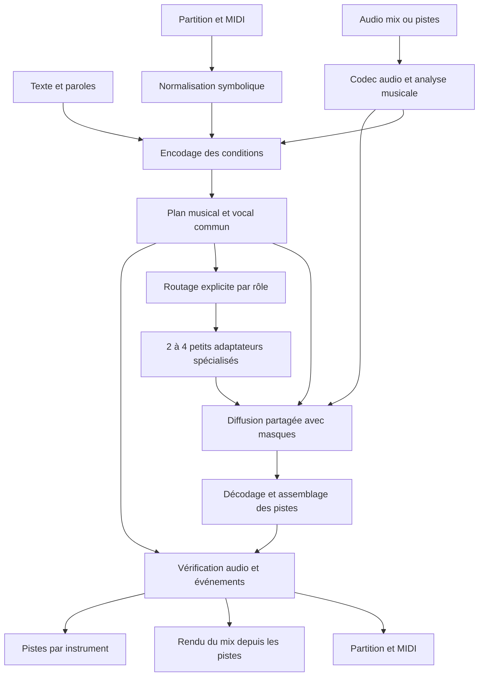

# Spécification fonctionnelle et technique du modèle musical

**Version :** 0.2 — conception proposée, pilote à adaptateurs confirmé, 1er octobre 2026. 
**Portée :** instrumental et chant dès la V1 ; décisions générales dans [README.md](README.md).

Les mots **DOIT**, **DEVRAIT** et **PEUT** indiquent respectivement une exigence de livraison, une recommandation et une option. Les chiffres de qualité et de ressources sont des cibles tant qu'un rapport d'expérience ne les confirme pas.

## 1. Objectif et usages

Le système DOIT produire une musique éditable à partir de contraintes multimodales. Les quatre familles d'entrée peuvent être combinées dans une même requête. Le choix des sorties est indépendant : mix seul, MIDI seul, partition seule, pistes seules ou toute combinaison.

| Entrée principale | Exemple | Résultat attendu |
|---|---|---|
| Texte | « Chanson folk française, voix douce, guitare et basse » + paroles | Composition, interprétation chantée et arrangement |
| Audio mixé | Démo d'un morceau existant | Cover, variante, réorchestration ou retouche d'un passage |
| Audio isolé / pistes | Voix enregistrée et guitare | Accompagnement cohérent, instruments supplémentaires, retouches ciblées |
| Partition | MusicXML d'une mélodie et d'accords | Interprétation, orchestration et voix si paroles fournies |
| MIDI | Mélodie jouée au clavier ou arrangement multipiste | Rendu audio, arrangement complémentaire, notation |
| Combinaison | Voix audio + basse MIDI + paroles + consigne de style | Conserver les éléments verrouillés et compléter les parties libres |

Le texte distingue description musicale, paroles et instructions d'édition. Le système DOIT comprendre les instructions françaises et anglaises. Une description de timbre vocal et une langue de chant font partie des contrôles V1.

## 2. Modes de travail

### 2.1 `generate` — création originale

Composer les parties manquantes, interpréter les notes fournies et générer les sorties demandées. Une entrée symbolique peut être stricte ou servir d'inspiration. Avec `vocal_mode=instrumental`, aucune voix chantée n'est demandée ; avec `singing`, les paroles fournies doivent être chantées.

Les paroles sont soit fournies, soit créées lorsque `lyrics.policy=generate` est explicitement demandé. Des paroles absentes avec `lyrics.policy=provided` produisent une erreur. Les tags de section sont des annotations, jamais du texte à chanter. Les mélismes associent plusieurs notes à une syllabe ; les répétitions de paroles sont explicites.

### 2.2 `continue` — prolongement

Ajouter une suite en tenant compte du dernier passage, des motifs, de la structure et des paroles déjà utilisées. La région source reste protégée. Une transition avec recouvrement utilise le même contrat de masque que l'inpainting ; aucun recouvrement implicite n'est autorisé.

### 2.3 `inpaint` — régénération locale

Régénérer uniquement les cellules **temps × piste** désignées : une fausse note de piano, huit mesures de batterie, une phrase chantée, une piste de basse entière ou plusieurs régions disjointes.

Le modèle utilise les passages avant/après et les autres pistes comme contexte. Le masquage a le même sens pendant l'entraînement et l'inférence : **1 = modifiable, 0 = protégé**.

### 2.4 `cover` — nouvelle interprétation

Produire une nouvelle interprétation d'une composition source. Les invariants par défaut sont **mélodie principale, paroles et ordre des sections** ; les accords sont conservés s'ils sont fournis ou confirmés. Style, instruments et timbres peuvent changer. Tempo et transposition sont des changements explicites.

Une mélodie transposée conserve intervalles et rythme relativement à la transformation annoncée. Un changement de tempo utilise une correspondance entre positions musicales source et cible. L'alignement et les invariants sont vérifiés dans ces coordonnées transformées.

À partir d'un mix sans partition, la mélodie, les accords et les paroles reconnus sont des estimations. Une cover stricte exige une représentation confirmée ou une analyse atteignant les seuils validés. Le modèle ne peut pas garantir l'identité d'une composition inconnue en se fondant uniquement sur une similarité audio globale.

La voix peut être régénérée avec un timbre choisi ou conservée comme piste audio lorsque les transformations le permettent. Changer tempo/tonalité d'une voix conservée transforme son signal et annule sa conservation PCM exacte ; la requête doit le préciser. Le transfert d'identité vocale depuis une référence nécessite des données et une évaluation spécifiques ; il n'est pas requis pour satisfaire la cover V1.

### 2.5 `variant` — autre version contrôlée

Créer N alternatives d'une version source avec un degré de changement et des dimensions ciblées. Exemples : autre ligne de basse, refrain plus énergique, nouvelle harmonisation, autre interprétation vocale ou variation du motif.

Chaque variante DOIT décrire ses modifications autorisées et ses invariants. Une nouvelle seed sans contrôle du contenu ne suffit pas à garantir une variante du même morceau. `transform.variation_strength` va de 0 à 1 ; sa relation aux changements musicaux doit être calibrée expérimentalement.

Avec une source déjà normalisée, une force nulle renvoie cette source sans génération. Pour une nouvelle ingestion, le résultat est la référence normalisée, avec transformation d'import documentée. Une cover peut avoir un style très différent tout en conservant sa mélodie ; sa fidélité et son intensité de transformation sont deux axes distincts.

### 2.6 `arrange` — compléter ou réorchestrer

Ajouter des instruments aux pistes connues, créer un accompagnement de voix, remplacer l'instrumentation de parties symboliques ou compléter un arrangement. Les parties verrouillées sont contextuelles ; elles ne sont pas réinterprétées sans autorisation dans la requête.

## 3. Entrées et normalisation

### 3.1 Texte et paramètres

| Champ | Sens |
|---|---|
| `prompt` | Genre, énergie, texture, instrumentation, intention musicale |
| `negative_prompt` | Caractéristiques à éviter ; contrôle souple sauf règle structurée équivalente |
| `lyrics` | Texte chanté, langue, sections et éventuels liens notes/syllabes |
| `vocal_mode` | `instrumental`, `singing` ou `preserve` ; `preserve` exige une piste vocale source |
| `constraints` | Durée, tempo, métrique, tonalité, sections et instruments |
| `constraint_policy` | `strict` ou `best_effort`, appliqué aux contraintes structurées |
| `preserve` | Événements, paroles, structures, pistes ou régions à verrouiller |

Un paramètre numérique ou une note verrouillée DOIT être un conditionnement structuré. Ajouter « 220 BPM » dans le prompt ne constitue pas un contrôle strict du tempo.

### 3.2 Audio

- WAV et FLAC mono/stéréo ; MP3 accepté comme format d'import décodé, pas comme référence de conservation exacte.
- Mix complet, voix seule, instrument seul ou ensemble de pistes ; origine et rôle déclarés.
- Original conservé avec empreinte ; décodage, fréquence, décalage initial et transformations journalisés.
- Référence canonique : PCM float32, 48 kHz, même origine temporelle pour toutes les pistes ; mono permis pour une source mono.
- Aucune normalisation de gain, détection de silence avec trim, suppression de bruit ni correction automatique sur les pistes protégées.
- Fréquence de travail du codec choisie par expérience. Toute conversion vers 48 kHz est documentée ; elle ne crée pas des détails absents de la bande d'origine.

La garantie « inchangé » porte sur la référence PCM décodée et normalisée à l'import. Une copie binaire du fichier original est conservée séparément. Les comparaisons utilisent les échantillons décodés, pas les octets d'en-tête WAV/FLAC.

### 3.3 Partition et MIDI

- MusicXML compressé ou non : notes, voix, mesures, silences, liaisons, paroles, accords, métrique et tempo.
- MIDI type 0/1 à temps musical : notes, vitesses, pistes, programmes, tempo, pédale et contrôleurs pris en charge.
- ABC : adaptateur avec liste explicite des constructions supportées ; aucun aplatissement silencieux des voix.
- Temps MIDI SMPTE et événements non pris en charge : diagnostic et conversion documentée, sinon refus.
- Notation expressive et performance restent distinctes : la quantification d'affichage ne doit pas écraser le timing interprété.

La photo/numérisation de partition n'est pas un format V1. Un import symbolique produit un rapport des informations conservées, converties et perdues. En mode strict, une perte affectant un invariant bloque la tâche.

### 3.4 Conflits multimodaux

Chaque condition porte `source_id`, `target_track_ids`, région, rôle (`content`, `style`, `performance`, `timbre`, `context`) et force. Cela permet d'utiliser une référence audio pour son style sans recopier sa mélodie.

Les règles de résolution sont :

1. Les verrous explicites et le masque définissent l'espace modifiable.
2. Les contraintes structurées strictes sont validées ensemble.
3. Une référence confirmée peut fixer les notes, paroles ou accords concernés.
4. Les estimations audio et les consignes textuelles libres guident les dimensions restantes.

Deux contraintes strictes incompatibles produisent `constraint_conflict`, avec les champs concernés. Exemple : MIDI verrouillé à 90 BPM et tempo strict à 120 sans transformation autorisée. Le moteur ne choisit pas une source en silence.

## 4. Sorties et cohérence

### 4.1 Artefacts

| Sortie | Contrat |
|---|---|
| `mix` | WAV PCM 24 bits ou FLAC sans perte ; stéréo 48 kHz ; nombre d'échantillons annoncé |
| `stems` | Une piste par partie/instrument, noms et identités stables ; même origine, fréquence et durée |
| `score` | MusicXML multiparti + PDF par moteur de gravure ; paroles pour les parties vocales |
| `midi` | Type 1 : piste de tempo et pistes instrumentales/vocales, programmes et contrôleurs supportés |
| `composition` | JSON musical avec notes, performance, alignements et provenance ; artefact interne toujours conservé |
| `manifest` | Modèles, sources, seeds, filiation, contraintes, masques effectifs, exports, empreintes et contrôles |

Le MIDI vocal encode les notes, les paroles en métadonnées lorsqu'elles sont supportées et la performance disponible. Il ne contient pas la voix enregistrée ; celle-ci appartient à la piste audio vocale.

Chaque note/événement exporté indique sa provenance : `provided`, `generated`, `transcribed` ou `pseudo_label`. Une confiance est donnée pour une estimation. Une partition transcrite depuis un mix est annoncée comme estimée ; elle ne devient pas une vérité terrain parce qu'elle s'exporte correctement.

### 4.2 Pistes par instrument

Une piste de guitare et une piste de piano doivent être séparément écoutables et éditables. Deux guitares ont deux `track_id` si elles ont des parties distinctes. Les pistes vocales principale et chœurs sont distinctes lorsqu'elles existent.

Le générateur DOIT apprendre la production des pistes. Une séparation après génération d'un mix peut servir de référence comparative ou d'analyse d'entrée, mais ne satisfait pas la génération native multipiste. `origin=generated_native`, `preserved_source` ou `separated_estimate` est indiqué par piste.

Une sélection de sorties ne doit pas changer la composition obtenue : pour une requête et un environnement déterministes identiques, demander les stems en plus ne doit pas générer une autre chanson.

### 4.3 Mix de référence et effets

Le mix de référence est un rendu déterministe des pistes livrées : gain/pan, effets de piste et sommation décrits dans `mix_recipe.json`. Les stems de référence sont livrés avant traitement master ; les retours d'effets partagés sont des pistes auxiliaires séparées lorsqu'ils sont utilisés.

Un master avec limiteur, compression ou effets non linéaires est un artefact supplémentaire `mastered_mix`. Sa reproduction nécessite la recette et les paramètres ; la somme brute des instruments n'est pas annoncée comme égale à ce master.

Pour un inpainting exigeant la conservation exacte du mix hors masque, le renderer réutilise aussi les échantillons protégés du mix parent. Si cette conservation contredit une nouvelle recette globale, il refuse le changement global ou exige une autre politique. La protection des pistes n'implique pas automatiquement celle d'un mix remasterisé.

### 4.4 Durée, tempo et sorties symboliques

- Durée audio stricte : `sample_count = round(duration_seconds × sample_rate_hz)` ; fin musicale planifiée, pas une simple coupe d'une note en cours.
- Durée en mesures : temps calculé depuis métrique et tempo ; les éventuelles queues d'effets ont une politique explicite `within_duration` ou `append_tail`.
- Durée en secondes et nombre de mesures simultanément stricts : validation de compatibilité ; une mesure finale partielle n'est créée que si autorisée.
- Tempo V1 proposé : 40–240 BPM par noire, changements par événements ; métriques validées initialement 3/4, 4/4 et 6/8.
- Partition et MIDI proviennent du plan réalisé et vérifié. Une intention de notes non respectée dans l'audio doit apparaître comme écart et bloquer une sortie annoncée strictement fidèle.

Pour une source audio seule, les parties transcrites peuvent être incomplètes. `best_effort` autorise ces estimations avec couverture et confiance visibles. `strict` refuse les sorties symboliques si les parties demandées ne peuvent pas être représentées avec la qualité validée. Aucun instrument demandé n'est omis silencieusement.

## 5. Contrat précis d'inpainting

### 5.1 Masque et verrous

Le masque canonique est une liste de rectangles `{track_id, start_sample, end_sample}`, intervalles **[début, fin[**, dans la référence 48 kHz. Les régions peuvent être disjointes. La sélection en mesures/ticks est convertie via la tempo map puis conservée dans le manifeste avec sa correspondance en échantillons.

Deux types de verrou sont distincts : `audio_exact` conserve le signal ; `musical_exact` conserve les événements et permet une nouvelle interprétation. Une piste entièrement protégée conserve ses événements, son PCM et ses métadonnées musicales.

Une note traversant une frontière et une syllabe partiellement masquée DOIVENT être traitées avant génération : conserver l'événement, choisir un masque élargi explicitement, ou refuser. L'espace de lecture contextuelle peut être plus grand que le masque d'écriture.

### 5.2 Transitions et effets

La requête choisit `boundary_policy=inside_mask` par défaut : fondus et réparation de raccord restent entièrement dans les intervalles autorisés. Une marge supplémentaire peut être proposée, mais ne devient modifiable que si elle est incluse dans la requête.

Les durées de fondus sont des valeurs de rendu, distinctes du contexte musical lu par le modèle. Une réverbération, un delay ou une note tenue peut traverser le masque ; une retouche doit conserver la portion protégée ou déclarer un conflit. Aucune queue d'effet ne justifie une modification hors masque.

### 5.3 Mise en œuvre et garantie

1. Lire le contexte et encoder les pistes sans écrire dans les sources.
2. Générer les cellules latentes masquées en conditionnant sur les pistes et temps observés.
3. Décoder avec contexte suffisant pour les champs réceptifs du codec.
4. Assembler le PCM : copier **exactement** les échantillons source aux positions protégées ; appliquer les fondus à l'intérieur du masque.
5. Ne modifier que les événements symboliques autorisés ; préserver les autres identifiants.
6. Vérifier l'égalité PCM hors masque, l'intégrité des événements protégés, les raccords et la recette de mix.

Le maintien des latents observés pendant le débruitage ne garantit pas l'identité de la waveform après décodage. L'assemblage final et son contrôle constituent la garantie. Le manifeste enregistre le masque demandé et effectif ; ils doivent être identiques sans extension autorisée.

### 5.4 Source constituée d'un seul mix

Un inpainting temporel de l'ensemble du mix peut préserver exactement le mix hors région. Une retouche d'un seul instrument exige une piste isolée ou une analyse préalable de séparation avec qualité déclarée.

Un instrument estimé à partir d'un mix ne permet pas de garantir l'absence de modification des autres instruments dans la région retouchée. `audio_exact` pour les instruments non ciblés exige des sources isolées ; sinon `insufficient_source_isolation`. En `best_effort`, les pistes estimées sont identifiées et cette limite apparaît dans le résultat.

## 6. Représentation musicale commune

Nom technique proposé : `CompositionGraph`, versionné indépendamment du checkpoint. Il contient :

| Entité | Informations nécessaires |
|---|---|
| Chronologie | 960 ticks/noire, tempo map, métriques, correspondance tick ↔ échantillon, décalages audio |
| Structure | Sections, mesures, anacrouse, répétitions dépliées, motifs et relations entre sections |
| Harmonie | Tonalité, changements de tonalité, accords avec positions et source/confiance |
| Piste | Identifiant, instrument, rôle, registre, programme MIDI, source et liens audio |
| Notes | Hauteur, début/durée notés, timing de performance, vélocité, articulation, liaison |
| Performance | Pédale, contrôleurs, pitch bend et courbes expressives pris en charge ; unités documentées |
| Chant | Paroles, langue, syllabes/phonèmes, notes associées, durées, F0, respiration et tessiture |
| Conditions | Entrées, rôles, forces, régions, verrous et transformations autorisées |
| Provenance | Identifiants de sources, estimation/annotation, confiance et versions |

La représentation distingue la hauteur écrite de la hauteur réelle des instruments transpositeurs. La batterie utilise une correspondance percussion explicite ; un numéro MIDI de percussion n'est pas traité comme une hauteur tonale. Les techniques hors représentation sont annoncées.

L'export conserve une table de correspondance entre identifiants de notes du graphe, notes MusicXML et événements MIDI. Le MIDI de performance peut contenir des écarts de timing expressifs par rapport à la notation ; ces écarts sont conservés dans la couche de performance et la table d'export. La concordance des formats porte sur leur identité musicale après cette correspondance, sans imposer une quantification de l'audio.

L'audio de référence peut être contextuel sans transcription exhaustive. Les opérations exigeant une identité de notes ou une exportation complète ont toutefois besoin d'événements confirmés ou estimés et évalués.

## 7. Architecture proposée

### 7.1 Vue d'ensemble

Il s'agit d'une proposition à comparer aux variantes du [plan d'entraînement](TRAINING_PLAN.md). Le dossier ne suppose pas qu'un modèle existant possède déjà tous ces blocs.

### 7.2 Encodeurs

- Encodeur textuel pour style et instructions ; représentation séparée des paroles.
- Encodeur d'événements pour notes, accords, tempo, sections, masques et instruments.
- Codec audio partagé pour pistes et contexte ; fréquence/latence et qualité vérifiées séparément pour voix et instruments.
- Analyse audio facultative : tempo, F0, accords, transcription multipiste, détection de parties et alignement des paroles ; sorties avec confiance.
- Encodeur de timbre/performance optionnel, évitant de confondre style et contenu musical.

### 7.3 Planificateur symbolique et vocal

Générer structure, harmonies, motifs, notes instrumentales, mélodie chantée et allocation temporelle des syllabes. Les événements fournis strictement sont recopiés et les parties inconnues complétées avec un décodeur à contraintes.

La voix est planifiée dès la V1 : tessiture, durée des syllabes, mélismes, zones de respiration, silences, phrases et chœurs. La quantité de paroles doit tenir dans la durée : diagnostic ou allocation révisée dans les dimensions autorisées.

### 7.4 Générateur audio multipiste

**Choix confirmé pour le pilote : générateur partagé de type Diffusion Transformer en espace latent, avec 2 à 4 petits adaptateurs spécialisés**, conditionné par le plan, le texte, les phonèmes et les pistes connues. Le checkpoint, les points d'insertion des adaptateurs et l'objectif exact de diffusion ou de flow matching sont fixés dans chaque expérience. Les latents du générateur multipiste cible sont indexés par **temps × piste × dimension** ; cette représentation reste une extension à développer si le checkpoint de départ ne la possède pas.

Utiliser une attention temporelle et une interaction entre pistes pour apprendre rythme, harmonie, équilibre et dépendances vocales/instrumentales. Les identifiants d'instrument et de rôle distinguent les parties ; un masque de présence permet un nombre variable de pistes.

Une branche vocale spécialisée dans le même système peut recevoir phonèmes, notes, durées et expression. Elle doit participer aux conditions musicales communes et aux entraînements multipistes ; un assemblage sans alignement de systèmes indépendants ne suffit pas.

Référence comparative : génération de tokens de codec avec Transformer multi-flux autorégressif ou masqué. Le choix final dépend des expériences de fidélité aux notes, isolation, inpainting, chant et coût, pas d'une préférence de vocabulaire.

#### 7.4.1 Adaptateurs et routage du pilote

Le générateur et le codec préentraînés sont partagés et initialement gelés. Les petits adaptateurs, par exemple LoRA, sont entraînés sur des rôles compatibles avec les données disponibles. Hypothèses de regroupement : chant, percussions, instruments harmoniques et parties mélodiques/basse ; leur nombre et leurs frontières sont ablatés. Les nouveaux encodeurs/conditionnements nécessaires aux notes et pistes restent des composants distincts à développer.

Un **adaptateur spécialisé au maximum** est actif par unité de génération. Le routage initial est déterministe et explicite à partir du rôle déclaré ou de métadonnées d'analyse disponibles à l'inférence. Il ne lit aucune cible audio ou annotation réservée à l'évaluation. Pour un rôle non couvert, le chemin commun utilise la base partagée et les conditionnements communs, sans expert spécialisé ; il est annoncé et évalué comme tel.

La sélection reste fixe pour cette unité pendant les étapes de diffusion et ses recouvrements. Commencer par la piste ou une fenêtre de piste lorsque cette unité existe ; un checkpoint limité au mix utilise une unité de mix documentée. Un adaptateur sélectionné pour un mix ne constitue pas une génération native par instrument. Tout changement de sélection entre fenêtres adjacentes est tracé et évalué pour les raccords et la stabilité du timbre.

Les adaptateurs partagent plan, chronologie, masques et attention musicale. Le pilote ne lance pas un générateur indépendant par instrument sans contexte des autres parties. Le routage n'augmente pas implicitement la région modifiable et n'altère pas les garanties PCM de la section 5.3.

Le nombre d'adaptateurs, leurs rangs, leurs points d'insertion et leur mémoire sont des paramètres mesurés ; « 2 à 4 » ne promet ni quatre instruments seulement ni une division du temps de calcul par quatre. Les entrées texte/audio/partition/MIDI restent encodées séparément, et les sorties symboliques proviennent du plan musical commun.

#### 7.4.2 Évolution éventuelle vers un MoE complet

Un véritable MoE interne peut remplacer certains blocs de calcul par des experts routés, avec des composants communs et l'attention entre pistes conservés. La spécialisation peut dépendre du rôle, de la tâche ou du niveau de bruit ; elle n'est pas supposée émerger automatiquement. Cette conversion est une expérience ultérieure, distincte d'un ensemble de petits adaptateurs sur une base dense.

Le passage à un routage appris, puis à un MoE complet, exige le protocole comparatif du [plan d'entraînement](TRAINING_PLAN.md#71-pilote-à-adaptateurs-et-décision-moe) : gain mesuré à coût comparable, sans régression au-delà des tolérances fixées sur validation, avec ressources compatibles. Le MoE n'est pas une condition de livraison de la V1 ; conserver la base partagée est une décision valide si ce passage échoue.

Le bilan inclut paramètres totaux, entraînables et actifs, tous les experts résidents, mémoire des optimisateurs, routage et nombre d'étapes de génération. Un petit nombre de paramètres actifs ne garantit ni un faible pic VRAM ni une inférence plus rapide.

### 7.5 Longue durée

Plan global de sections et motifs, puis synthèse par fenêtres avec contexte des autres pistes et des fenêtres voisines. Débuts de fenêtres alignés sur la chronologie commune, compensation du délai codec et recouvrement contrôlé.

La V1 complète doit conserver motifs, timbre vocal et structure jusqu'à 240 s. Une bonne génération de 20 s ne suffit pas. Les répétitions voulues sont distinguées des boucles accidentelles et des paroles involontairement répétées.

### 7.6 Vérification et corrections

Valider les événements avant audio, puis contrôler audio et exports. Les corrections automatiques ne peuvent toucher que les régions autorisées. Chaque tentative est journalisée ; limite initiale proposée : deux régénérations internes ciblées, puis erreur de contrainte ou résultat `best_effort` avec écarts explicites.

Un correcteur ne modifie pas les verrous pour rendre sa propre mesure meilleure. Pour des notes difficiles à transcrire, la vérification associe analyse audio indépendante et écoute humaine dans le protocole de validation.

## 8. API d'inférence proposée

L'API décrite ici est un **nouveau contrat à implémenter**. Les exemples JSON sont des requêtes de conception, pas des appels exécutables sur le worker actuel.

### 8.1 Ressources et endpoints

| Endpoint proposé | Rôle |
|---|---|
| `GET /v1/music/capabilities` | Checkpoint, tâches, formats, langues, limites et profils validés |
| `POST /v1/music/assets` | Ingestion immuable d'un fichier ou d'une collection de pistes indexée ; renvoie `asset_id`, empreinte et métadonnées |
| `POST /v1/music/jobs` | Soumission d'une requête ; réponse avec identifiant de job |
| `GET /v1/music/jobs/{job_id}` | État, phases, avertissements et résultats |
| `POST /v1/music/jobs/{job_id}/cancel` | Annulation ; aucune version finale partielle |
| `GET /v1/music/jobs/{job_id}/artifacts/{artifact_id}` | Artefact validé et empreinte |

Les `asset_id` viennent d'ingestions réussies ; aucun chemin arbitraire du poste client ni URL distante libre n'est une condition utilisable. Les exemples utilisent des identifiants fictifs à remplacer. Les sorties sont téléchargées ou importées dans le projet par l'adaptateur applicatif.

### 8.2 Structure d'une requête

| Champ | Contrat |
|---|---|
| `schema_version` | `music-generation/v1` pour ce dossier |
| `request_id` | Identifiant d'idempotence de la soumission ; même ID + requête différente = conflit |
| `mode` | `generate`, `continue`, `inpaint`, `cover`, `variant`, `arrange` |
| `source_version_id` | Version parent, obligatoire pour variante, continuation et inpainting |
| `prompt` / `lyrics` | Consigne et paroles structurées ; `lyrics` requis pour `singing` avec politique `provided` |
| `conditions[]` | Ressources audio/score/MIDI, rôles, pistes cibles, régions et force 0–1 |
| `constraints` | Durée, tempo, métrique, tonalité, sections et `tracks[]` avec identifiants |
| `preserve` | `audio_track_ids`, `symbolic_track_ids`, `musical_features` et politique de conservation |
| `edit_regions[]` | Pistes, intervalles d'échantillons et verrous locaux pour inpainting/édition |
| `transform` | Style, tempo, transposition et dimensions de variante autorisés |
| `render` | Fréquence, boundary policy, fondus, recette de mix, politique de queues |
| `outputs[]` | `mix`, `stems`, `score`, `midi` ; au moins une sortie |
| `sampling` | Seed entière 0–2³²−1, nombre de candidats 1–4 en V1, preset versionné |
| `constraint_policy` | `strict` ou `best_effort` ; défaut strict sur les contraintes vérifiables |

Les champs inconnus sont refusés. Les variantes candidates héritent de la source avec un manifeste et une seed dérivée distincts. Une capacité absente est refusée avant génération.

### 8.3 Forme des objets et règles complémentaires

- `lyrics` : `{policy: provided|generate, language, sections[]}` ; chaque section fournie a `section_id` et `text`. `language` utilise un code comme `fr` ou `en`. Si une partie vocale fournie fait autorité, les paroles explicites doivent lui correspondre.
- `conditions[]` : `{kind: audio|score|midi, asset_id, role, target_track_ids[], strength, confirmed?}`. Une région facultative utilise `start_sample`/`end_sample` sur la chronologie canonique. `confirmed` concerne les annotations de contenu ; il n'est jamais déduit automatiquement d'une forte `strength`.
- `constraints` : `duration_seconds`, `bar_count?`, `tempo_map[]` (`tick`, `quarter_bpm`), `time_signatures[]` (`tick`, `numerator`, `denominator`), `key_signatures[]` (`tick`, `tonic`, `mode`), `sections[]` (`id`, `start_tick`, `end_tick`), `tracks[]` (`id`, `instrument`, `role`). Les ticks sont toujours en PPQ 960 et les maps sont ordonnées.
- Les identités d'instrument et rôle proviennent du catalogue versionné de `/capabilities`. Le catalogue initial comprend les valeurs utilisées dans les exemples et les huit familles de validation ; il distingue identité de piste et famille d'instrument.
- `preserve` : listes `audio_track_ids` et `symbolic_track_ids`, `musical_features[]` parmi `melody|lyrics|harmony|structure|tempo|key`, et `outside_edit_regions?=audio_exact|musical_exact`. Par défaut, l'inpainting utilise `audio_exact` hors région ; les pistes et événements non ciblés restent protégés.
- `transform` : `transpose_semitones?`, `target_quarter_bpm?`, `variation_strength?` et `change_dimensions[]` parmi `style|instrumentation|vocal_timbre|performance|melody|harmony|tempo|key|structure|lyrics`. Une transposition ou un changement de tempo conserve les autres invariants dans les nouvelles coordonnées. Les voix régénérées et les nouvelles orchestrations peuvent modifier la performance, dans les tolérances musicales déclarées.
- `render` : `sample_rate_hz=48000`, `audio_format=wav_pcm24|flac24`, `boundary_policy?=inside_mask`, `crossfade_samples?`, `tail_policy=within_duration|append_tail`, `mix_policy=from_stems|preserve_outside_edit_regions`. Les fondus restent dans le masque et ne peuvent dépasser ses régions. Pour `append_tail`, le manifeste distingue durée musicale et durée audio finale ; il faut préciser la durée de queue et lever toute durée audio incompatible.
- `outputs` contient des valeurs uniques et au moins un élément. `score` produit MusicXML et PDF ; `midi` produit un MIDI type 1. Le JSON interne et le manifeste accompagnent toute réussite.

La `duration_seconds` porte sur la durée audio **finale totale**, y compris le parent pour `continue`. Un inpainting conserve cette durée sauf mode d'extension distinct explicitement demandé. Les exemples utilisent des durées sans queue ajoutée.

`confirmed=true` signifie qu'une représentation a été confirmée à l'ingestion par son auteur/utilisateur ou par un processus de validation tracé. Le serveur vérifie cette provenance ; un drapeau dans une requête ne transforme pas un fichier inconnu en annotation fiable.

En cover, les seules dimensions hors invariants sont modifiables par défaut : style, instrumentation, timbre et performance. Une dimension protégée ne peut changer que via une transformation déclarée compatible (par exemple transposition de la mélodie), sinon `constraint_conflict`. En variante, la liste `change_dimensions` définit les libertés demandées ; les autres propriétés héritent de la source.

En génération de partition/MIDI seuls, `duration_seconds` exprime la durée de performance projetée ; il n'existe aucun `sample_count` audio à mesurer. Le résultat renseigne `sample_count=null`, la tempo map et la durée symbolique calculée. Pour `append_tail`, un champ `render.tail_seconds` positif complète la durée musicale planifiée ; `duration_seconds` doit déjà inclure cette queue.

### 8.4 États et résultat

États : `queued → validating → analyzing → planning → generating → rendering → verifying → completed`, avec `failed` et `cancelled` possibles. Les phases non nécessaires sont omises ; leur durée réelle est enregistrée. Le progrès utilise les étapes effectivement connues, sans ETA inventée.

Le résultat DOIT contenir `job_id`, `version_id`, `parent_version_id`, `model_revision`, `schema_version`, `composition_asset_id`, `sample_count`, `tracks`, `artifacts`, `constraint_report`, `warnings` et `reproducibility`.

`constraint_report` contient pour chaque exigence : cible, mesure, tolérance, statut `passed|failed|unverified` et méthode. `unverified` ne peut pas satisfaire une contrainte stricte. Les artefacts comportent type, piste, format, hash et origine. `completed` exige tous les exports demandés, lisibles et conformes au contrat choisi.

Le manifeste conserve paramètres, entrées normalisées, verrous, masques, transforms, seeds, version codec, checkpoint, runtime et précision numérique. Pour les variantes à adaptateurs/experts, il ajoute révisions et empreintes des adaptateurs, rangs et points d'insertion, politique de routage versionnée, correspondance rôles/adaptateurs, unités sélectionnées et recours au chemin commun. Une seed est reproductible dans un environnement déterministe fixé ; elle ne promet pas l'identité des samples entre matériels et kernels différents.

### 8.5 Erreurs prévues

`invalid_input`, `unsupported_format`, `unsupported_capability`, `constraint_conflict`, `ambiguous_alignment`, `insufficient_source_isolation`, `insufficient_transcription`, `mask_out_of_bounds`, `boundary_conflict`, `lyrics_do_not_fit`, `resource_limit`, `constraint_not_met`, `artifact_invalid`.

Une tâche trop grande pour le matériel fournit les limites observées et des profils compatibles. Le nombre de pistes, la durée et la précision ne sont pas réduits en silence. Les sorties validées sont publiées atomiquement ; un échec ne remplace pas la version source.

## 9. Intégration Song Maker

- Nouveau provider de génération derrière une interface de capacités ; YuE2 garde son contrat propre.
- Adaptateur `CompositionGraph ↔ ScoreDocument` versionné. Les données non représentables sont conservées dans un sidecar ; les pertes d'export sont signalées.
- Imports MusicXML et exports MusicXML/PDF à implémenter ; ils ne sont pas supposés exister dans le moteur actuel.
- Pistes natives importées dans Production avec instrument, origine, alignement et filiation ; pas de renommage d'un groupe « other » en plusieurs instruments fictifs.
- Sélections temporelles/pistes de l'éditeur converties en masque de job, puis aperçu des régions modifiables.
- Covers et variantes créent des prises filles ; restauration et comparaison avec la source.
- Worker du modèle en processus séparé, local par défaut ; voie distante seulement via le mécanisme opt-in du produit.
- Extension versionnée du contrat remote existant ; ne pas supposer que les routes proposées sont déjà supportées.

Parcours attendu : importer/créer → choisir le mode et les invariants → lancer → écouter mix et pistes isolées → consulter/éditer la partition et le MIDI → comparer et conserver une prise.

## 10. Livrables du modèle

Poids et adaptateurs versionnés, configurations d'encodage/décodage et de routage, code d'entraînement et d'inférence, schémas de requête/résultat, convertisseurs de formats, modèle de manifeste, corpus de validation redistribuable ou recettes d'accès, model card, dataset cards et rapports d'évaluation. Le rapport du pilote inclut la comparaison adaptateur unique / 2 à 4 adaptateurs et la décision motivée sur la suite MoE.

Chaque checkpoint annonce les tâches réellement évaluées. Un poids performant en génération libre n'est pas annoncé compatible inpainting ou cover sans validation correspondante. Les critères mesurables sont dans [ACCEPTANCE_TESTS.md](ACCEPTANCE_TESTS.md).
